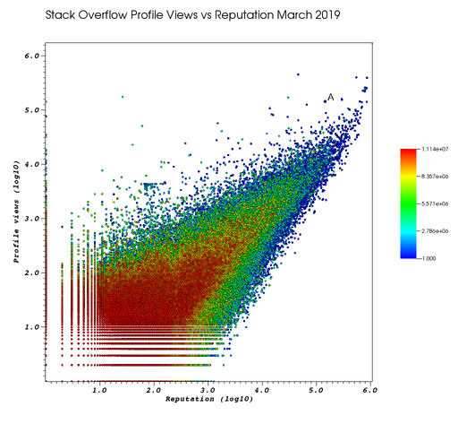
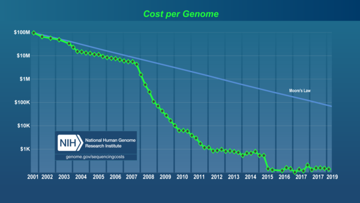

= Ciro Santilli (三西猴)
:description: Software engineer. Passion for low-level technologies and educational applications. Opinions are my own.
:docinfo: shared
:eqnums: all
:idprefix:
:idseparator: -
:nofooter:
:sectanchors:
:sectlinks:
:sectnumlevels: 6
:sectnums:
:stem:
:toc-title:
:toc: macro
:toclevels: 6
:cirosantilli-booktree: https://github.com/booktree/booktree
:cirosantilli-china-dictatorship: https://github.com/cirosantilli/china-dictatorship
:cirosantilli-github: https://github.com/cirosantilli
:cirosantilli-formal-mathematics-answer: https://math.stackexchange.com/questions/53969/what-does-formal-mean/3297537#3297537
:cirosantilli-posix: https://stackoverflow.com/questions/1780599/what-is-the-meaning-of-posix/31865755#31865755
:cirosantilli-repo-url: https://github.com/cirosantilli/cirosantilli.github.io
:cirosantilli-stack-overflow: https://stackoverflow.com/users/895245
:cirosantilli-stack-overflow-android-build-and-emulate: https://stackoverflow.com/questions/1809774/how-to-compile-the-android-aosp-kernel-and-test-it-with-the-android-emulator/48310014#48310014
:cirosantilli-twitter: https://twitter.com/cirosantilli
:cirosantilli-x86-bare-metal-examples: https://github.com/cirosantilli/x86-bare-metal-examples
:cirosantilli-website: https://cirosantilli.com
:cirosantilli-wiki-oracle-v-google: https://en.wikipedia.org/wiki/Oracle_America,_Inc._v._Google,_Inc.
:cirosantilli-youtube-heat-equation: https://www.youtube.com/watch?v=FOwYDlay8rI "Real-time heat equation OpenGL visualization with interactive mouse cursor using relaxation method" by "Ciro Santilli" published on 2016-12-10.

////
Pass through block here otherwise a space is generated on the output.
////
++++

\[
%% physics package
% Partial derivative.
\newcommand{\curl}[1]{\nabla \times #1}
\newcommand{\dv}[2]{\frac{\partial #1}{\partial #2}}
\newcommand{\divergence}[1]{\nabla \cdot #1}
% Vector Arrow.
\newcommand{\va}[1]{\overrightarrow{#1}}

%% Real analysis
\newcommand{\RThree}[0]{\mathbb{R}^{3}}
\newcommand{\RTwo}[0]{\mathbb{R}^{2}}
\newcommand{\R}[0]{\mathbb{R}}
\newcommand{\functionDomain}[3]{#1 : #2 \to #3}

%% Electromagnetism
% Magnetic field vector
\newcommand{\B}[0]{\va{\mathbf{B}}}
% Electric field vector
\newcommand{\E}[0]{\va{\mathbf{E}}}
% Electric current vector.
\newcommand{\J}[0]{\va{\mathbf{J}}}
\newcommand{\vacuumPermittivity}[0]{\varepsilon_0}
\newcommand{\vacuumPermeability}[0]{\mu_0}
\]

++++

{description}

link:{cirosantilli-github}[GitHub] |
link:{cirosantilli-stack-overflow}[Stack Overflow ] |
link:https://www.linkedin.com/in/cirosantilli[LinkedIn] |
link:https://www.youtube.com/channel/UCBrJjpKMpdrkA1VsAiR2wEg[YouTube] |
link:{cirosantilli-twitter}[Twitter] |
link:https://www.zhihu.com/people/cirosantilli/activities[Zhihu 知乎] |
link:https://www.weibo.com/p/1005055601627311[Weibo 微博] |
xref:accounts-controlled-by-ciro-santilli[Other accounts]

link:ciro-santilli-id-photo-2013.jpg[image:ciro-santilli-id-photo-2013.jpg[height=300]] link:ciro-santilli-logo.png[image:ciro-santilli-logo.png[height=300]]

toc::[]

== Ciro Santilli

Ciro Santilli is a https://en.wikipedia.org/wiki/Male[male] https://en.wikipedia.org/wiki/Human[human] born in xref:brazil[] in 1989 https://en.wikipedia.org/wiki/Anno_Domini[AD].

Quick facts:

* Nationalities: Italian and Brazilian
* Grew up in: Brazil
* Relationship status 2017-: married
* Chinese name: 三西猴, means "three western monkeys". Phonetic approximation to SANtilli CIRO. Semi-unintentionally reminds Chinese people of https://en.wikipedia.org/wiki/Sun_Wukong[Sun Wukong].
* Laptop: high end ThinkPad
* Distro: latest Ubuntu release
* Vim or Emacs: Vim. But for The Love, will someone please make an open source C++ IDE that actually just works?
* Tabs or spaces: spaces
* Mailing list or Git(Hub|Lab): Git(Hub|Lab), link:https://webapps.stackexchange.com/questions/23197/reply-to-mailman-archived-message/115088#115088[with passion]
* System or unit tests: system
* Default programming languages: Python and C++. xref:programming-language-choice[he'll learn Rust and Haskell once he's rich]
* Favorite musical instruments to listen: https://en.wikipedia.org/wiki/Guqin[Chinese Guqin] and xref:the-best-music-albums-of-all-time[electric Jazz-fusion guitar]

=== The most important projects done by Ciro Santilli

xref:ciro-santilli[] has sometimes wasted time with low impact projects such as those listed at xref:ciro-santillis-minor-projects[] instead of doing higher impact projects such as those mentioned at: xref:the-most-important-projects-ciro-santilli-wants-to-do[xrefstyle=full].

But maybe "Everything you did brought you where you are now." applies, maybe it is during the "low impact activities" that one gets the inspiration and experience required for the "high impact ones".

==== Linux Kernel Module Cheat

https://github.com/cirosantilli/linux-kernel-module-cheat

This is the most important technical tutorial project that xref:ciro-santilli[] has done in his life so far as of 2019.

The scope is insane and unprecedented, and goes beyond Linux-kernel-land alone.

It ate up every system programming content he had previously written, including:

* C, C++, POSIX
* x86 and arm userland assembly
* arm baremetal assembly. x86 baremetal is at: https://github.com/cirosantilli/x86-bare-metal-examples and would in theory be migrated, but he'm lazy
* QEMU and gem5 emulation

so that this repo would better be called "System Programming Cheat". But "Linux Kernel Module Cheat" sounds more hardcore ;-)

Other major things that could be added there as well in the future are:

* https://github.com/cirosantilli/algorithm-cheat
* link:https://en.wikipedia.org/wiki/Computer_architecture[computer architecture] tutorials with gem5

==== Ciro Santilli's Stack Overflow contributions

{cirosantilli-stack-overflow}

[link={cirosantilli-stack-overflow}]
.Ciro Santilli's amazing Stack Overflow profile
image::https://stackoverflow.com/users/flair/895245.png?theme=dark[Stack overflow flare]

xref:ciro-santilli[]'s xref:stack-overflow[] contributions have, unsurprisingly, centered around the subjects he has worked with: systems programming and web development, and necessary tooling to get those done, such a Git, Python, Bash and Ubuntu.

His best answers are listed at: xref:the-best-articles-by-ciro-santilli[xrefstyle=full]

In Stack Overflow Ciro likes to:

* answer important questions found through Google which he needs to solve an actual problem he has right now, and for which none of the existing answers satisfied him, and close duplicates.
* monitor less known tags which very few people know a lot about, but in which he specializes

When he gets an upvote on one of his more obscure answers, he often re-read it, and often finds improvements to be made and makes them.

He doesn't like to refresh the homepage looking for easy rep on widely known subjects.

For this reason, https://stackoverflow.com/help/badges/17/necromancer[Necromancer] is Ciro's favorite badge (get 5 upvotes on a question older than 60 days), and as of July 2019, https://data.stackexchange.com/stackoverflow/query/300735/users-with-most-necromancer-badges-at-a-given-date?Date=2019-07-15[he became the #1 user with the most of this badge]. Announcement link:https://twitter.com/cirosantilli/status/1146157392343785474[on Twitter].

The number two is link:https://stackoverflow.com/users/6309[VonC], who has about 16 times more answers than Ciro in total! From this query: https://data.stackexchange.com/stackoverflow/query/1072396?&Date=2019-07-01&UserId=895245 it can be seen that as of July 2019, 1216 out of his 1329 answers were answered 60 days after the questions and constitute potential necromancers! Compare that to VonC's 1643 potential necromancers out of 21767 answers!

Stack Overflow reputation is of course, in itself, meaningless. People who contribute to popular subjects like web development will always have infinitely more reputation that the low level subjects.

For example, his most upvoted answer as of July 2019 is https://stackoverflow.com/questions/18875674/whats-the-difference-between-dependencies-devdependencies-and-peerdependencies/22004559#22004559 was written when he spent his first week playing with NodeJS (he was having a look at https://www.sharelatex.com/[ShareLaTeX], later merged into https://www.overleaf.com/[Overleaf], for xref:write-free-books-to-get-famous-website[education]), which he didn't touch again for several years, and still hasn't "mastered" as of 2019!

What happens on the specialized topics though is that you end up getting to know all the 5 users who contribute 95% of the content pretty soon as you study those subjects.

Ciro's deep understanding of Stack Overflow mechanisms and its shortcomings also helped shape his ideas for: xref:write-free-books-to-get-famous-website[].

After answering so many questions, he ended up converging to a more or less consistent style, which he formalized at: https://meta.stackexchange.com/questions/18614/style-guide-for-questions-and-answers/326746#326746

==== Ciro Santilli's campaign for freedom of speech in China

{cirosantilli-china-dictatorship}

Since 2015 xref:ciro-santilli[] has carried out a campaign to promote freedom of speech in xref:china[].

The campaign has centered around {cirosantilli-china-dictatorship}/tree/714d8104549ea19714787f148ff93c7403fd120c#why-keyword-attack[publishing censored keywords] on his xref:stack-overflow[] username, thus using his xref:ciro-santillis-stack-overflow-contributions[considerable Stack Overflow presence] to sabotage the website in China. Here is an early http://web.archive.org/web/20150602004401/https://stackoverflow.com/users/895245/ciro-santilli-%e5%85%ad%e5%9b%9b%e4%ba%8b%e4%bb%b6-%e6%b3%95%e8%bd%ae%e5%8a%9f-%e7%ba%b3%e7%b1%b3%e6%af%94%e4%ba%9a%e8%83%a1%e6%b5%b7%e5%b3%b0[web archive].

[[image-xi-jinping-chrysanthemum-230-liusi]]
[link=#image-xi-jinping-chrysanthemum-230-liusi]
.https://www.independent.co.uk/news/world/asia/chinese-artist-who-posted-funny-image-of-president-xi-jinping-facing-five-years-in-prison-as-10282630.html[Chrysanthemum Xi Jinping] with https://en.wikipedia.org/wiki/1989_Tiananmen_Square_protests[六四] spice added by Ciro Santilli
image::xi-jinping-chrysanthemum-230-liusi.jpeg[]

Like most people in the West, Ciro has always been for political freedom of speech, and therefore against the Chinese government's policies.

However, the seriousness of the matter only fully dawned on him in 2015 when, his mother-in-law, a then a 63-year-old lady, {}was put into jail for 15 days for doing {cirosantilli-china-dictatorship}/tree/714d8104549ea19714787f148ff93c7403fd120c#falun-gong[Falun Gong].

The rationale of this is to force the Chinese Government to either:

* leave things as they are, and let censored keywords appear on Stack Overflow (most likely scenario)
* block Stack Overflow, and lose billions of dollars with worse IT technology
* disable the Great Firewall

In the beginning, this {cirosantilli-china-dictatorship}/tree/236407528ab6424504e442e070d632496c110087#backlinks-to-this-repository[generated some commotion], but activity reduced as novelty wore off, and as he collected the reply to all possible comments at: {cirosantilli-china-dictatorship}.

This campaign has led him to have an insane profile view / reputation ratio, since many people pause to look at his profile. He is point "A" at the top right corner of xref:image-stack-overflow-reputation-profile-views-ciro-santilli[xrefstyle=full]:

[[image-stack-overflow-reputation-profile-views-ciro-santilli]]
.Stack Overflow reputation vs Profile Views as of 2019 with Ciro Santilli marked as "A" 
[link=#image-stack-overflow-reputation-profile-views-ciro-santilli]

Further analysis has been done at: https://stats.stackexchange.com/questions/376361/how-to-find-the-sample-points-that-have-statistically-meaningful-large-outlier-r

==== Ciro Santilli's minor projects

These are some smaller projects that xref:ciro-santilli[] carried out. They are all either for fun, or misguided use of his time done by an younger self:

* Naughty stuff. Ciro likes being naughty.
** xref:stack-overflow-vote-fraud-script[] How do you think Ciro got xref:ciro-santillis-stack-overflow-contributions[his rep]? Just kidding. Stack Overflow later forbade Ciro from advertising this project as described at: xref:ciro-santillis-stack-overflow-suspension-for-vote-fraud-script-2019-03-20[xrefstyle=full]
** GitHub makes Ciro feel especially naughty:
*** https://github.com/cirosantilli/all-github-commit-emails[All GitHub Commit Emails]: he extracted (almost) all Git commit emails from GitHub with Google BigQuery
*** https://github.com/cirosantilli/test-many-commits-1m/[A repository with 1 million commits]: likely the https://www.quora.com/Which-GitHub-repo-has-the-most-commits/answer/Ciro-SantilliI[live repo with the most commits as of 2017]
*** https://stackoverflow.com/questions/20099235/who-is-the-user-with-the-longest-streak-on-github/27742165#27742165[An 100 year GitHub streak], likely longest ever when that existed. It was consuming too much server resources however, which led to GitHub admins manually https://web.archive.org/web/20151021135921/https://github.com/cirosantilli/[turning off his contribution history].
*** https://github.com/cirosantilli/test-octopus-100k[A repository with a 100k commit Git octopus merge]. Now that is a true https://softwareengineering.stackexchange.com/questions/314215/can-a-git-commit-have-more-than-2-parents/377903#377903[Cthulhu merge].
* Because Ciro xref:write-free-books-to-get-famous-website[cares about education], around 2014 he looked into markup languages and version control for books, before he noticed that this approach was useless and that ranking algorithms are all that matter:
** https://gitlab.com/gitlab-org/gitlab-ce[GitLab]: very important to Ciro because he wanted to base {cirosantilli-booktree}[Booktree] on it.
+
He was https://github.com/gitlabhq/gitlabhq/graphs/contributors?from=2013-01-01&to=2015-01-01&type=a[the number 2 contributor from 2013 to 2015].
+
He implemented some large features and several smaller improvements.
+
For this reason, Ciro was made a moderator of https://www.reddit.com/r/gitlab[/r/gitlab] in https://web.archive.org/web/20160524164714/https://www.reddit.com/r/gitlab/about/moderators[2016-05].
+
GitLab sent Ciro a free swag bottle later after they got funding on to thank him for his contributions: xref:image-gitlab-bottle-beach[xrefstyle=full]. He had to pay for the beach trip though.
+
[[image-gitlab-bottle-beach]]
[link=#image-gitlab-bottle-beach]
.Ciro Santilli at the beach with his GitLab bottle

** link:/markdown-style-guide[Markdown Style Guide]
** https://github.com/karlcow/markdown-testsuite[Markdown Testsuite improvements]: Ciro has implemented the test runner a few months before CommonMark left stealth mode and killed it instantaneously.
+
At least MacFarlane was able to https://github.com/jgm/CommonMark/blob/2528c87c0cf08e02eb3e201c149cb3acf521e0c8/test/normalize.py#L8[reuse] part of the HTML normalizer https://github.com/karlcow/markdown-testsuite/blame/639cd234d71ca81956b61ff7876f37c3cdc5c043/run-tests.py[he wrote], and he extracted the multi-engine comparison to: https://github.com/cirosantilli/commonmark-implementation-compare[CommonMark Implementation Compare].
+
Playing with this project has led him to find and report many Markdown bugs / bad behavior on other software, e.g. https://github.com/isaacs/github/issues/297[GitHub] and https://github.com/fletcher/MultiMarkdown-4/issues/68[MultiMarkdown-4].
** https://github.com/isaacs/github[isaacs/github public unofficial GitHub issue tracker]: he has commented there so often that he https://github.com/isaacs/github/issues/430#issuecomment-123851480[was made a collaborator]
* Vim: sometimes Ciro goes crazy and wasted his time with Vimscript:
** https://github.com/plasticboy/vim-markdown[Vim Markdown]: the owner `plasticboy` was really nice and made Ciro a collaborator for his contributions, notably a live ToC outline and the header mappings
** https://github.com/cirosantilli/vundle-plugin-tester[Vundle Plugin Tester], which he used to start the testing system of Vim Markdown
* https://github.com/cirosantilli/breakthrough-message[Breakthrough Message]: aliens!!! Creative / media project, powered by some Python scripts.

=== The most important projects Ciro Santilli wants to do

These are projects which Ciro seriously considering doing, and which he believe could have a considerable impact in the world, given a few months of work.

They are sorted in order of "most likely to get done first".

==== Write free books to get famous website

https://github.com/cirosantilli/write-free-science-books-to-get-famous-website

In this project, xref:ciro-santilli[] wants to explore if it is possible to create a sustainable website that will make people write university-level natural science books for free.

The initial incentive for those people is to make them famous and allow them to get more fulfilling jobs more easily, although Ciro also wants to add money transfer mechanisms to it later on.

The key intended technical innovation of the website is a PageRank-like algorithm that answers the key questions:

* who knows the most about subject X
* what is the best content for subject X

where any user can create any new subject X.

Ciro envisioned a Wikipedia-like page, where you can fork a version of any subject or header to improve it, suggest changes via a "GitHub-pull-request-like" mechanism, and create bug reports under any given header.

Then, while reading an article about a subject, say, "The Fundamental Theorem of Calculus", you would be able to click a button, and easily view the other best articles about that subject.

Many subjects have changed very little in the last hundred years, and so it is mind-blowing that people have to pay for books that teach them!

More than that however, if such project succeeds, it could fundamentally change the way university is organized, enormously improving its efficiency.

It could destroy the current educational system and replace it by one that lets people choose what they want to learn.

===== Write free books to get famous website motivation

Since xref:ciro-santilli[] was young, he has been bewildered by the natural sciences and mathematics.

As a result, he has always suffered a lot at school: his grades were good, but he wasn't really learning those beautiful things that he wanted to learn!

School, instead of helping him, was just wasting his time with superficial knowledge.

First, before university, school organization had only one goal: put you into the best universities, to make a poster out of you and get publicity, so that more parents will be willing to pay them money to put their kids into good university.

Then, after entering university, although things got way better, teachers were still to a large extent researchers who didn't want to, know how to and above all have enough time and institutional freedom to teach things properly and make you see their beauty.

This is especially true because Ciro was in xref:brazil[], a third world country, where the opportunities are comparatively extremely limited to the first world.

And all of this is considering that was he was very lucky and was already in some of the best educational institutions locally available already, and had comparatively awesome teachers. he wouldn't be where he is today if he hadn't had such advantages in the first place.

But no matter how awesome one teacher is, no single person can overcome a system so large and broken, without technological innovation that is.

The key problem all along the way is the Society's / Government's belief that everyone has to learn the same things, and that grades in exams mean anything.

Ciro believes however, that exams are useless, and that there are only two meaningful metrics:

* reputation points for doing useful work for society
* how much money you make

Around 2012 however, he finally saw the light.

Firstly, he was introduced to LaTeX, and his mind was blown. "Ha, so I can write my own books, and so can anyone, for free?" he though. Why isn't everyone doing that!

Then he found two websites that changed his life forever, and made be believe that there was an alternative: xref:ciro-santillis-stack-overflow-contributions[Stack Overflow] and {cirosantilli-github}[GitHub].

The brutal openness of it all. The raw high quality content. Ugliness and uselessness too no doubt. But definitely spark in a sea of darkness.

University was not needed anymore. He could learn whatever he wanted. A vision was born.

To make things worse, for a long time he was tired of seeing poor people begging on the streets every day and not doing anything about it.

So, by the time he left University, instead of pursuing a PhD in theoretical Mathematics or Physics just for the beauty of it as he had once considered, he had new plans.

We needed a new educational system. One that would allow people to fulfill their potential and desires, and truly xref:unconditional-basic-income[improve society as a result], both in rich and poor countries.

And he found out that programming and applied mathematics could also be fun, so he might as well have some fun while doing this! ;-)

So he started {cirosantilli-booktree}[Booktree] in 2014, worked on it for an year, noticed the idea was dumb, and then started building this new idea and the courage to do it.

==== Large cohesive game world for robotic-like artificial intelligence development

Prototype: https://github.com/cirosantilli/Urho3D-cheat YouTube demo: https://www.youtube.com/watch?v=j_fl4xoGTKU

Less good discrete prototype: https://github.com/cirosantilli/rl-game-2d-grid YouTube demo: https://www.youtube.com/watch?v=TQ5k2u25eI8

Prior art research: https://github.com/cirosantilli/awesome-reinforcement-learning-games

[[image-ai-game-2d-continuous-basketball]]
[link=#image-ai-game-2d-continuous-basketball]
.Screenshot of the "Basketrock" stage

The goal of this project is to reach xref:artificial-general-intelligence[artificial general intelligence].

A few initiatives have created reasonable sets of robotics-like games for the purposes of AI development, most notably: link:https://en.wikipedia.org/wiki/OpenAI[OpenAI] and link:https://en.wikipedia.org/wiki/DeepMind[Google DeepMind].

However, all projects so far have only created sets of unrelated games, or worse: focused on closed games designed for humans!

What is really needed is to create a single cohesive game world, designed specifically for this purpose, and with a very large number of game mechanics.

Notably, by "game mechanic" is meant "a magic aspect of the game world, which cannot be explained by object's location and inertia alone". For example:

* when you press a button here, a door opens somewhere far away
* when you touch certain types of objects, a chemical reaction may happen, but not other types of objects

Much in the spirit of link:http://www.gvgai.net/[], we have to do the following loop:

* create an initial game
* find an AI that beats it well
* study the AI, and add a new mechanic that breaks the AI, but does not break a human!

The question then becomes: do we have enough computational power to simulation a game worlds that is analogous enough to the real world, so that our AI algorithms will also apply to the real world?

To reduce computation requirements, it is better to focus on a 2D world at first. Such world with the right mechanics can break any AI, while still being faster to simulate than a 3D world.

The initial prototype uses the Urho3D open source game engine, and that is a reasonable project, but a raw SDL + Box2D + OpenGL solution from scratch would be faster to develop for this use case, since Urho3D has a lot of human-gaming features that are not needed, and because 2019 Urho3D lead developpers https://github.com/cirosantilli/china-dictatorship/blob/23c5bd936361f78a8dd6bd1f412286808714d2da/communities-that-censor-politics.md[disagree with the China censored keyword attack].

==== Website front-end for a mathematical formal proof system

When xref:ciro-santilli[] first learnt the old link:https://en.wikipedia.org/wiki/Zermelo%E2%80%93Fraenkel_set_theory[Zermelo–Fraenkel set theory] and the idea of link:https://en.wikipedia.org/wiki/Formal_proof[Formal proofs], his mind was completely blown.

Finally, there it was: a proper and precise definition of xref:mathematics[], including https://en.wikipedia.org/wiki/Set-theoretic_definition_of_natural_numbers[a definition of integers], reals and limits!

Theorems are strings, proofs are string manipulations, and axioms are the initial strings that you can use.

Once proved, press a button on your computer, and the proof is automatically verified. No messy complicated "group of savants" reading it for 4 years and looking for flaws!

There are a few formal proof systems with several theorems in their Git tracked standard library. The hottest ones are:

* https://github.com/HOL-Theorem-Prover/HOL[]
* https://github.com/seL4/isabelle[]. Rumours have it that this is "uncompilable" from source without xref:evil[blobs]. It does however offer a very rich IDE.
* https://github.com/coq/coq[]
* http://metamath.org/ this one is likely an older and less powerful system, but the web presentation and tutorial are very good! Source: https://github.com/metamath/metamath-exe Here is a proof that 2 + 2 equals 4: http://us.metamath.org/mpeuni/2p2e4.html

And here are some more interesting links:

* https://github.com/awesomo4000/awesome-provable an awesome list of formal stuff
* https://devel.isa-afp.org/ Isabelle Archive of Formal Proofs. A curated list of Isabelle proofs, with minimal web UI. This is almost what we need, but without the manual curation, and with a better web UI.
* http://www.cs.ru.nl/~freek/100/ list of how many of the http://web.archive.org/web/20080105074243/http://personal.stevens.edu/~nkahl/Top100Theorems.html["Top 100 theorems"] had been proved in several formal systems.

However, it is unbelievable mind, that there isn't one awesome and dominating website, that hosts all those proofs, possibly an on the browser editor, and which all mathematicians in the world use as the one golden reference of mathematics to rule them all! 

Just imagine the impact.

Standard library maintainers don't have to deal with the impossible question of what is "beautiful" or "useful" enough mathematics to deserve merged: users just push content to the online database, and star what they like!

Interested in a conjecture? No problem: just subscribe to its formal statement + all known equivalents, and get an email on your inbox when it gets proved!

Are you a garage mathematician and have managed to prove a hard theorem, but no will will read your proof? Fuck that, just publish it on the system and let it get auto verified. Overnight fame awaits.

Notation incompatibility hell? A thing of the past, just automatically convert to your preferred representation.

Such a system would be the perfect companion to xref:write-free-books-to-get-famous-website[]. Just like computer code offers the backbone of xref:linux-kernel-module-cheat[] Linux kernel tutorials, a formal proof system website would be the backbone of mathematics tutorials!

Furthermore, it would not be too hard to achieve this system!

All we would need would be something analogous to a package registry like https://pypi.org/[Python's PyPI] or https://www.npmjs.com/[NodeJS' registry].

Then, each person can publish packages containing proofs.

Packages can rely on other packages that contain pre-requisites definition or theorem.

Packages are just regular git repos, with some metadata. One notable metadata would be a human readable description of the theorems the package provides.

The package registry would then in addition to most package registries have a CI server in it, that checks the correctness of all proofs, generates a web-page showing each theorem.

All proofs can be conditional: the package registry simply shows clearly what axiom set a theorem is based on.

Bibliography:

* https://math.stackexchange.com/questions/1767070/what-is-the-current-state-of-formalized-mathematics/3297536#3297536
* https://stackoverflow.com/questions/19421234/how-do-i-generate-latex-from-isabelle-hol
* https://stackoverflow.com/questions/30152139/what-are-the-strengths-and-weaknesses-of-the-isabelle-proof-assistant-compared-t

==== Molecular biology is the next big thing so do anything in that area

https://github.com/cirosantilli/awesome-whole-cell-simulation

As of 2019, xref:moores-law[the silicon industry is ending], and molecular biology technology is the most promising and growing field.

Such advances could one day lead to both xref:unconditional-basic-income[biological super-AGI and immortality].

First, during the 2000's, the cost of sequencing fell to about 1000 USD per genome in the end of the 2010's: xref:image-human-genome-sequencing-cost-evolution[xrefstyle=full]. The medical consequences of this revolution are still trickling down the application ladder today, inevitably, but somewhat slowly due to tight control of medical records.

[[image-human-genome-sequencing-cost-evolution]]
[link=#image-human-genome-sequencing-cost-evolution]
.Cost per genome vs Moore's law from 2000 to 2019, image https://www.genome.gov/sites/default/files/inline-images/Sequencing_Cost_Per_Genome_Feb%202019.png[by the NIH]

Then, in the 2010's, https://en.wikipedia.org/wiki/CRISPR_gene_editing[CRISPR/Cas9 gene editing] started opening up the way to actually modifying the genome that we could now see.

What's next?

https://en.wikipedia.org/wiki/DNA_synthesis[DNA synthesis], see for example: https://twistbioscience.com/ | https://www.evonetix.com/technology/ | http://dnascript.co/ | https://www.ansabio.com/ | https://www.nuclera.com/

Other cool topic include: simulations of cell metabolism, protein and small molecule, microscopy (cristalography, cryo-EM), analytical chemistry (mass spectroscopy), single cell techniques (Single-cell RNA sequencing), ...

It's weird, cells feel a lot like xref:linux-kernel-module-cheat[embedded systems]: small, complex, hard to observe, and profound.

xref:ciro-santilli[] is sad that by the time he dies, humanity won't have understood the brain, maybe not even a measly E. Coli...

The only other fields that might become as big are:

* xref:quantum-computing[]
* https://en.wikipedia.org/wiki/Fusion_power

but those have had enourmous investments for several decades without any fruits. Molecular biology is a much lower hanging fruit.

==== Videos of all key physics experiments

It is unbelievable that you can't find easily on YouTube recreations of many of the key physics / chemistry experiments.

The videos must be completely reproducible, indicating the exact model of every experimental element used, and how the experiment is setup.

A bit like what xref:ciro-santilli[] does in his xref:ciro-santillis-stack-overflow-contributions[Stack Overflow contributions] but with computers!

It is understandable that some experiments are just to complex and expensive to re-create, as an extreme example say, a precise description of the https://en.wikipedia.org/wiki/Large_Hadron_Collider[LHC], but up to the mid 20th century? We should have all of those nailed down.

We should strive to achieve the cheapest most reproducible setup possible.

Furthermore, it is also desirable to reproduce the original setups whenever possible in addition to having the most convenient modern setup.

Lists of good experiments to cover be found at: xref:the-most-important-physics-experiments[].

=== The best articles by Ciro Santilli

These are the articles ever authored by xref:ciro-santilli[], most of them in the format of xref:stack-overflow[] answers.

Ciro posts updates on Twitter when new considerably cool ones are published: {cirosantilli-twitter}

* Trended on https://news.ycombinator.com/[Hacker News]
** {cirosantilli-x86-bare-metal-examples}[x86 Bare Metal Examples] on https://news.ycombinator.com/item?id=19428700[2019-03-19]. The third time something related to that repo trends. Hacker news people really like that repo!
** https://stackoverflow.com/questions/22054578/how-to-run-a-program-without-an-operating-system/32483545#32483545[How to run a program without an operating system?] on https://web.archive.org/web/20181126123625/https://news.ycombinator.com[2018-11-26]. Covers x86 and ARM.
** link:/elf-hello-world[ELF Hello World Tutorial] on https://web.archive.org/web/20170517174951/https://news.ycombinator.com/news[2017-05-17]
** link:/x86-paging[x86 Paging Tutorial] on https://news.ycombinator.com/item?id=13773219[2017-03-02]. Number 1 Google search result for "x86 Paging" https://archive.is/VUSNt[in 2017-08].
* x86 Assembly
** https://stackoverflow.com/questions/980999/what-does-multicore-assembly-language-look-like/33651438#33651438[What does “multicore” assembly language look like?]
* Linux kernel
** https://unix.stackexchange.com/a/219674/32558[What do the flags in /proc/cpuinfo mean?]
** https://stackoverflow.com/a/31394861/895245[How does kernel get an executable binary file running under linux?]
** https://unix.stackexchange.com/questions/17122/is-it-possible-to-install-the-linux-kernel-alone/200572#200572[Is it possible to install the linux kernel alone?]
** https://stackoverflow.com/questions/11408041/how-to-debug-the-linux-kernel-with-gdb-and-qemu/33203642#33203642[How to debug the Linux kernel with GDB and QEMU?]
** https://stackoverflow.com/questions/33852690/can-the-sys-execve-system-call-in-the-linux-kernel-receive-both-absolute-or-re/42290593#42290593[Can the sys_execve() system call in the Linux kernel receive both absolute or relative paths?]
** https://stackoverflow.com/questions/5957570/what-is-the-difference-between-the-kernel-space-and-the-user-space/44285809#44285809[What is the difference between the kernel space and the user space?]
** https://stackoverflow.com/questions/5748492/is-there-any-api-for-determining-the-physical-address-from-virtual-address-in-li/45128487#45128487[Is there any API for determining the physical address from virtual address in Linux?]
** https://stackoverflow.com/questions/2429511/why-do-people-write-the-usr-bin-env-python-shebang-on-the-first-line-of-a-pyt/40938801#40938801[Why do people write the `#!/usr/bin/env` python shebang on the first line of a Python script?]
** https://unix.stackexchange.com/questions/122717/how-to-create-a-custom-linux-distro-that-runs-just-one-program-and-nothing-else/238579#238579[How to create a custom Linux distro that runs just one program and nothing else?]
** https://unix.stackexchange.com/questions/5518/what-is-the-difference-between-the-following-kernel-makefile-terms-vmlinux-vml/482978#482978[What is the difference between the following kernel Makefile terms: vmLinux, vmlinuz, vmlinux.bin, zimage & bzimage?]
* QEMU
** https://stackoverflow.com/questions/28315265/how-to-add-a-new-device-in-qemu-source-code/44612957#44612957[How to add a new device in QEMU source code?]
** https://askubuntu.com/questions/281763/is-there-any-prebuilt-qemu-ubuntu-image32bit-online/1081171#1081171[How to generate Ubuntu `debootstrap` disk images for QEMU?]
** https://stackoverflow.com/questions/10949169/how-to-create-a-multi-partition-sd-image-without-root-privileges/52850819#52850819[How to create a multi partition SD disk image without root privileges?]
* GCC
** https://stackoverflow.com/questions/3322911/what-do-linkers-do/33690144#33690144[How do linkers and address relocation works?]
** https://stackoverflow.com/a/30308151/895245[How many GCC optimization levels are there?]
** https://stackoverflow.com/questions/29391965/what-is-partial-linking-in-gnu-linker/53959624#53959624[What is incremental linking or partial linking?]
** https://stackoverflow.com/questions/3476093/replacing-ld-with-gold-any-experience/53921263#53921263[GOLD (`-fuse-ld=gold`) linker vs the traditional GNU ld]
* C / C++
** https://stackoverflow.com/questions/572547/what-does-static-mean-in-a-c-program/14339047#14339047[What does “static” mean in a C program?]
** https://stackoverflow.com/questions/1041866/in-c-source-what-is-the-effect-of-extern-c/30526795#30526795[In C++ source, what is the effect of extern “C”?]
** https://stackoverflow.com/questions/10186765/char-array-vs-char-pointer-in-c/30661089#30661089[Char array vs Char Pointer in C]
** https://stackoverflow.com/questions/847179/multiple-glibc-libraries-on-a-single-host/52454603#52454603[How to compile glibc from source and use it?]
* IEEE 754
** https://stackoverflow.com/questions/8341395/what-is-a-subnormal-floating-point-number/53203428#53203428[What is a subnormal floating point number?]
** https://stackoverflow.com/questions/18118408/what-is-difference-between-quiet-nan-and-signaling-nan/55648118#55648118[What is difference between quiet NaN and signaling NaN?]
** https://stackoverflow.com/questions/2618059/in-java-what-does-nan-mean/55673220#55673220[In Java, what does NaN mean?]
* Algorithms
** https://stackoverflow.com/a/29548834/895245[Heap vs Binary Search Tree (BST)]
* Git internals
** https://stackoverflow.com/a/25806452/895245[What does the git index contain EXACTLY?]
* Python
** https://stackoverflow.com/a/19950198/895245[What is the difference between old style and new style classes in Python?]
** https://stackoverflow.com/a/20022860/895245[What is a mixin in Python, and why are they useful?]
* Web
** https://stackoverflow.com/a/28380690/895245[What does enctype='multipart/form-data' mean?]
** https://stackoverflow.com/a/23877420/895245[How does JavaScript .prototype work?]
** https://stackoverflow.com/a/24595458/895245[.prop() vs .attr()]
* OpenGL
** https://stackoverflow.com/questions/3191978/how-to-use-glut-opengl-to-render-to-a-file/14324292#14324292[How to use GLUT/OpenGL to render to a file?]
** https://stackoverflow.com/questions/8847899/opengl-how-to-draw-text-using-only-opengl-methods/36065835#36065835[How to draw text using only opengl methods?]
** https://stackoverflow.com/questions/30864752/is-it-possible-to-build-a-heatmap-from-point-data-at-60-times-per-second/39839788#39839788[Is it possible to build a heatmap from point data at 60 times per second?]
** https://stackoverflow.com/questions/2571402/how-to-use-glortho-in-opengl/36046924#36046924[How to use `glOrtho()` in OpenGL?]
* Node.js
** https://stackoverflow.com/a/22004559/895245[What's the difference between dependencies, devDependencies and peerDependencies in npm package.json file?]
* Rails
** https://stackoverflow.com/a/25626629/895245[What is the difference between +<%+, +<%=+, +<%#+ and +-%>+ in ERB in Rails?]
* xref:POSIX[]
** {cirosantilli-posix}[What is POSIX?]
* Systems programming
** https://stackoverflow.com/questions/868568/what-do-the-terms-cpu-bound-and-i-o-bound-mean/33510470#33510470[What do the terms “CPU bound” and “I/O bound” mean?]
** https://stackoverflow.com/questions/556405/what-do-real-user-and-sys-mean-in-the-output-of-time1/53937376#53937376[What do 'real', 'user' and 'sys' mean in the output of time?]
* Security
** https://security.stackexchange.com/a/72569/53321[Why is the same origin policy so important?]
* Media
** https://stackoverflow.com/questions/2205070/programmatically-synthesizing-programming-music/52126471#52126471[How to programmatically synthesize music?]
** https://stackoverflow.com/questions/12831761/how-to-resize-a-picture-using-ffmpegs-sws-scale/36487785#36487785[How to resize a picture using ffmpeg's sws_scale()?]
* Non technical
** https://github.com/cirosantilli/how-to-teach-efficiently[How to teach efficiently]
* Eclipse
** https://stackoverflow.com/questions/4038760/how-to-set-up-the-eclipse-for-remote-c-debugging-with-gdbserver/45608937#45608937[How to set up the Eclipse for remote C debugging with gdbserver?]
* Hardware
** https://www.quora.com/Are-there-good-open-source-standard-cell-libraries-to-learn-IC-synthesis-with-EDA-tools/answer/Ciro-Santilli[Are there good open source standard cell libraries to learn IC synthesis with EDA tools?]
* Scientific visualization
** https://stackoverflow.com/questions/5854515/large-plot-20-million-samples-gigabytes-of-data/55967461#55967461[A survey of open source interactive plotting software with a 10 million point scatter plot benchmark on Ubuntu 18.10]
* xref:numerical-analysis[]
** {cirosantilli-youtube-heat-equation}
* RTL, Verilog, VHDL
** https://stackoverflow.com/questions/38108243/is-it-possible-to-do-interactive-user-input-and-output-simulation-in-vhdl-or-ver/38174654#38174654[Is it possible to do interactive user input and output simulation in VHDL or Verilog?]
* xref:android[]
** {cirosantilli-stack-overflow-android-build-and-emulate}[How to compile the Android AOSP kernel and test it with the Android Emulator?]

=== How to contact Ciro Santilli

To contact xref:ciro-santilli[] publicly about any general subject that is not covered in a more specif repository, including saying hi or suggestions about his website, create a GitHub issue at: {cirosantilli-repo-url}/issues/new

For comments about China first read:

* https://github.com/cirosantilli/china-dictatorship#faq
* https://github.com/cirosantilli/china-dictatorship/blob/master/CONTRIBUTING.md

and then create a GitHub issue at: https://github.com/cirosantilli/china-dictatorship/issues/new

If you need private contact, extract his email from on of his GitHub repos or use LinkedIn.

link:https://en.wikipedia.org/wiki/Disqus[Disqus comments] were removed from his website in 2019-05-04, a manual dump is link:/disqus-archive/[available here], removal rationale at: xref:why-ciro-santilli-removed-disqus-comments-from-his-website-in-2019-05-04[].

=== Accounts controlled by Ciro Santilli

xref:ciro-santilli[] controls the following accounts:

* http://seqanswers.com/forums/member.php?u=90053
* http://answers.gazebosim.org/users/2289/cirosantilli/
* https://4programmers.net/Profile/86786
* https://9gag.com/u/cirosantilli
* https://addons.mozilla.org/en-US/firefox/user/cirosantilli/
* https://androidforums.com/members/ciro-santilli.1918307
* https://ask.libreoffice.org/en/users/2352/cirosantilli/
* https://bbs.archlinux.org/profile.php?id=116270
* https://brilliant.org/profile/ciro-il1uxz/
* link:++https://bugzilla.gnome.org/page.cgi?id=describeuser.html&login=ciro.santilli@gmail.com++[]
* https://cirosantilli.blogspot.com/
* https://cirosantilli.imgur.com
* https://community.arm.com/people/cirosantilli
* https://community.atlassian.com/t5/user/viewprofilepage/user-id/680821
* https://community.plos.org/people/cirosantilli
* https://community.skype.com/t5/user/viewprofilepage/user-id/2646858
* https://community.zimbra.com/members/cirosantilli
* https://del.icio.us/cirosantilli
* https://dev.to/cirosantilli
* https://developer.mbed.org/users/cirosantilli/
* https://devtalk.nvidia.com/member/2118846/
* https://droit-finances.commentcamarche.net/profile/user/cirosantilli
* https://en.wikipedia.org/wiki/User:Ciro.santilli is also mine, but Ciro lost the password
* https://en.wikipedia.org/wiki/User:Cirosantilli2
* https://eternagame.org/web/player/260828/
* https://figshare.com/authors/Ciro_Santilli/656781
* https://forum.osdev.org/memberlist.php?mode=viewprofile&u=16372
* https://forum.videolan.org/memberlist.php?mode=viewprofile&u=173503
* https://forum.xda-developers.com/member.php?u=7116837
* https://forums.androidcentral.com/members/cirosantilli-2734491
* https://framasphere.org/people/78a975c0b6c40133a3032a0000053625 https://framasphere.org/posts/1519871
* https://gitlab.com/u/cirosantilli
* https://hackaday.io/cirosantilli
* https://identity.kde.org/index.php?r=people/view&uid=cirosantilli
* https://jsfiddle.net/user/cirosantilli/
* https://launchpad.net/~cirosantilli
* https://nanohub.org/members/146301/
* https://next-episode.net/user/cirosantilli/
* https://opencollective.com/ciro-santilli
* https://orcid.org/0000-0003-2895-7763
* https://peerj.com/cirosantilli/
* https://profiles.3dgames.com.ar/profiles/1002278
* https://pypi.org/user/cirosantilli/
* https://software.intel.com/en-us/user/1090688
* https://soundcloud.com/cirosantilli
* https://steamcommunity.com/id/cirosantilli/
* https://support.mozilla.org/en-US/user/cirosantilli
* https://tabmixplus.org/forum/memberlist.php?mode=viewprofile&u=59846
* https://talk.commonmark.org/users/cirosantilli
* https://talk.jekyllrb.com/users/cirosantilli
* https://talks.cam.ac.uk/user/show/81142
* https://tatoeba.org/eng/user/profile/cirosantilli
* https://telegram.me/cirosantilli
* https://tuleap.net/users/cirosantilli
* https://tuleap.ring.cx/users/cirosantilli
* https://twittercommunity.com/users/cirosantilli/activity
* https://wiki.qemu.org/User:Cirosantilli
* https://www.airbnb.com/users/show/45794827
* https://www.bibsonomy.org/user/cirosantilli
* https://www.biostars.org/u/50170/
* https://www.bulletphysics.org/Bullet/phpBB3/memberlist.php?mode=viewprofile&u=11704
* https://www.codingame.com/profile/cddd0a711c22d97e8264361f7c8205567563841
* https://www.dailymotion.com/ciro-santilli
* https://www.digitalocean.com/community/users/cirosantilli
* https://www.ebay.com/usr/cirosantilli
* https://www.edaboard.com/member587087.html
* https://www.flickr.com/photos/141515492@N02/
* https://www.freecodecamp.org/fcc8f660b91-167c-4b04-a8da-5d50cdb46def
* https://www.gitbook.com/@cirosantilli
* https://www.hackerrank.com/cirosantilli
* https://www.hackster.io/cirosantilli
* https://www.html5gamedevs.com/profile/30103-cirosantilli/
* https://www.imdb.com/user/ur59802249
* https://www.instagram.com/cirosantilli/
* https://www.kaggle.com/cirosantilli
* https://www.linux.org/members/ciro-santilli.62540/
* https://www.linuxquestions.org/questions/user/cirosantilli-688439/
* https://www.meetup.com/members/252568305/
* https://www.mentebinaria.com.br/profile/1987-ciro-santilli/
* https://www.metacritic.com/user/cirosantilli
* https://www.mudhut.com/user/1995000
* https://www.myopportunity.com/en/profile/ciro-santilli
* https://www.opengl.org/discussion_boards/member.php/40269-cirosantilli
* https://www.patreon.com/cirosantilli
* https://www.plurk.com/cirosantilli
* https://www.quora.com/profile/Ciro-Santilli
* https://www.raspberrypi.org/forums/memberlist.php?mode=viewprofile&u=273389
* https://www.reddit.com/user/cirosantilli/ https://www.reddit.com/r/CirosantilliTest0/comments/5ek3di/i_own_this_website/
* https://www.shadertoy.com/user/cirosantilli
* https://www.tastekid.com/ciro.santilli
* https://www.ted.com/profiles/5822760
* https://www.transifex.com/user/profile/cirosantilli
* https://www.tripadvisor.com/members/cirosantilli

Accounts in Chinese websites. These accounts might be banned or altered or offer other limitations, so Ciro only communicates briefly through them:

* http://bbs.nibaedu.com/index.php?m=space&uid=70
* http://www.renren.com/338003848/profile
* http://www.tianya.cn/109285544 (can't post, no cell phone)
* https://pincong.rocks/people/cirosantilli
* https://tieba.baidu.com/home/main?id=5cd56369726f73616e74696c6c69c944
* https://v2ex.com/member/cirosantilli
* https://www.zhihu.com/people/cirosantilli. Ciro was https://github.com/cirosantilli/china-dictatorship/tree/746d7e851097bfacfb03149138f0e16c8da9d8db#zhihu-ban[banned in 2018-06-25].

Dead websites:

* http://www.citeulike.org/user/cirosantilli (2019-05)

A younger unrelated Argentinian homonym that can be found through Google:

* https://www.facebook.com/profile.php?id=100009065024069
* https://www.youtube.com/channel/UCY44wYp2nEuhMRBU1kHkdCA
* https://twitter.com/cirosantilli7

=== Ciro Santilli's ideology

Welcome to the wonderful world of Cirism!

==== Unconditional basic income

https://en.wikipedia.org/wiki/Basic_income[Unconditional basic income] is xref:ciro-santilli[]'s' ultimate https://en.wikipedia.org/wiki/Transhumanism[non-transhumanist] technological dream: to reach a state of technological advancement and distribution of resources so high that everyone gets money for doing nothing, enough for:

* basic survival needs: food, housing, clothes, hygiene, etc.
* two children to keep the world going. Or immortality tech, but is harder and borderline transhumanist :-)
* high speed computer and Internet

Once a person has that, they can xref:write-free-books-to-get-famous-website[learn, teach] and create whatever they want. Or play xref:the-best-video-game-content-of-all-time[video games] all day long if they wish.

https://en.wikipedia.org/wiki/Basic_income_pilots[Ciro santilli will not live to see this], and is content with helping it happen faster by increasing the efficiency of the world as. And having at least two well educated kids to carry on the project after he dies :-)

Technologies which would help a lot towards unconditional basic income, and might be strictly required required are:

* xref:artificial-general-intelligence[]
* affordable https://en.wikipedia.org/wiki/Humanoid_robot[humanoid robots] with human-like energy efficiency and https://en.wikipedia.org/wiki/Power-to-weight_ratio[power-to-weight ratio].
+
This is even less likely than AGI due to the xref:moores-law[end of silicon Moore's Law] and at the start of the Genome's Moore's law: information doubles, small sizes halve, but macroscopic mechanical artifacts stay the same.
+
https://en.wikipedia.org/wiki/Brain%E2%80%93computer_interface[brain–computer interfaces] are pretty certain to happen however after xref:ciro-santilli[] dies, in particular https://github.com/cirosantilli/essays/blob/7e1147daeb941a95b96b099d0db0474db25116ea/questions-for-my-future-self.md[full BCI as defined here].
+
So in the worst case we can just grow brainless bodies and replace the cavity hole with a computer that controls the body, possibly with high level decisions coming from a remote building-sized genetically engineered biological AGI brain.

Of course, it is all about costs. A human costs about http://content.time.com/time/health/article/0,8599,1808049,00.html[130k 2010 USD / year]. So how cheap can we make the AGI / robot human equivalent / year for a given task?

AGI + humanoid robots likely implies https://en.wikipedia.org/wiki/AI_takeover[AI takeover] though. It would then come down to human loving bots vs human hating bots fighting it out. It will be both terrifying and fun to watch.

AGI alone would be very dangerous, in case it can get control of our nuclear arsenals through software zero days or https://en.wikipedia.org/wiki/Social_engineering_%28security%29[social engineering]. Although some https://www.quora.com/Could-a-group-of-hackers-break-into-military-networks-and-launch-or-detonate-nuclear-missiles[claim that is unlikely].

Humanity's best bet to achieve silicon AGI today is to work on: xref:large-cohesive-game-world-for-robotic-like-artificial-intelligence-development[]

==== Having more than one natural language is bad for the world

Natural language diversity is beautiful, but useless.

The fact that in poor countries a huge number of people do not speak the economically dominating language of the world (currently English), is a major obstacle to the development of those countries.

Despite us being in the information age, the people in those countries cannot fully benefit from it at all!

Teaching its people English should be the number one priority of any country. Without that, there can be no technological development. Everything else is secondary and can be learnt off the Internet once you know English.

And the most efficient way to do that, is that every country should create amazing free open source English learning material for their own language.

Also consider the xref:europe[European] countries.

What big companies have been created in Europe in the past 50 years, that have not been bought out by xref:united-states-of-america[American] or Japanese companies?

The key problem is that there are so many small countries in Europe, that any startup has to deal with too many incompatible legislation and cannot easily sell to the hole of Europe.

So then a larger company from a more uniform country comes and eats it up!

So why can't Europe unify its laws?

Because the countries are still essentially walled off by languages.

There isn't true mobility of people between countries.

You just can't go study or work in any other country (except for the UK, when it was still in the EU) without putting a huge effort into learning its language first.

Without this, there isn't enough mixing to truly make cultures more uniform, and therefore allow the laws to be more uniform.

Europe can't even unify basic things like a marriage registry, or the posting of parcels, which often get lost and require you to contact people who may not speak English.

For this reason, Europe will only continue to go downhill with the years, and the UK will continue to try and https://en.wikipedia.org/wiki/Mitochondrion[endosymbiose] into a state of the xref:united-states-of-america[USA].

It is the European https://en.wikipedia.org/wiki/Tower_of_Babel[Tower of Babel].

The https://en.wikipedia.org/wiki/Linguistic_relativity[Sapir–Whorf hypothesis] is bullshit outside of poetry, and the ending of https://en.wikipedia.org/wiki/Arrival_(film)[Arrival (2016)] makes one want to puke.

==== Programming language choice

There is only space for two languages at most in the world: the compiled one, and the interpreted one.

For now, when you have a choice, you must go for:

* Python as the interpreted one
* C++ for compiled

Those two are languages not by any means perfect from a language design point of view, and there are likely already better alternatives, they are only chosen due to a pragmatic tradeoff between ecosystem and familiarity.

Bash can also be used when you're lazy. But if the project goes on, you will sooner or later regret that choice.

The language syntax in itself does not matter. All that matters is how many useful libraries and tooling it has.

This is how other languages compare:

* C cool, but cannot make a large codebase DRY without insanity
* Ruby: the exact same as Python, and only strong in one domain: web, while Python rules everything else, and is not bad on web either. So just kill Ruby, please.
* JavaScript: it is totally fine if NodeJS destroys Python and becomes the ONE scripting language to rule them all since Python and JavaScript are almost equally crappy.
+
People just don't use it much because of ecosystem / unfamiliarity.
* Java: good language, but has an ugly enterprisey ecosystem, Oracle has made / kept the development process too closed, and {cirosantilli-wiki-oracle-v-google}[API patenting madness on Android just kills if off completely]
* Haskell: many have tried to learn some functional stuff, but too hard. Sounds really cool though.
* Rust: sounds cool, you will gladly replace C and C++ with it if the ecosystem ramps up.
* Go: likely a good replacement for Python. If the ecosystem gets there, you will gladly use it more.
* Swift: xref:apple-inc[] is xref:evil[]
* C#: xref:microsoft-windows[Microsoft] is xref:evil[]
* Tcl, Perl: Python killed them way back and is less insane
* R, GNU Octave: all of this is a waste of society's time, applied mathematicians are capable of writing a few braces in exchange for a sane general purpose language, we should just invest in good libraries with fast C bindings for those languages like NumPy where needed. And when Ciro see the closed source ones like MATLAB being used, it makes him lose all hope on humanity.

=== Ciro Santilli's website

xref:ciro-santilli[]'s website is hosted at {cirosantilli-website}.

==== License of Ciro Santilli's website

xref:ciro-santilli[]'s website is licensed as: link:https://creativecommons.org/licenses/by-sa/4.0/[CC BY-SA 4.0] unless otherwise noted on a more specific page or header. The license can also be found at: link:LICENSE[].

==== How to develop Ciro Santilli's website

His website is powered by link:https://pages.github.com[GitHub Pages].

The source code is located at: {cirosantilli-repo-url}

Build locally, watch for changes and rebuild automatically, and start a local server with:

....
bundle install
./run
....

and then visit the website at:

....
xdg-open http://localhost:8000
....

After making any changes to the README.adoc, simply refresh the page to view the updates.

If you make changes to other files however, e.g. image, you must also do the full rebuild with:

....
./build
....

Source: link:build[]

Publish changes:

....
git add -u
git commit -m 'make yourself look sillier'
./publish
....

Source: link:publish[]

GitHub forces us to use the master branch for the build output... so the actual source is in the branch `dev`.

Update the gems with:

....
bundle update
git add Gemfile.lock
git commit -m 'update gems'
....

His website was originally written in Markdown and link:https://github.com/jekyll/jekyll[Jekyll], however those were deprecated in favour of Asciidoctor when Ciro saw the light, rationale shown at: link:/markdown-style-guide#use-asciidoc[]

Jekyll is only used now for backwards compatibility to not break some key content with high PageRank, Ciro might kill it entirely at some point.

GitHub pages is chosen instead of a GitHub README for the following reasons:

* Ciro will want some unsupported extensions, notably mathematics, likely with Katex server side:
** https://github.com/asciidoctor/asciidoctor/pull/3338
** https://stackoverflow.com/questions/11256433/how-to-show-math-equations-in-general-githubs-markdownnot-githubs-blog
** https://g14n.info/2014/09/math-on-github-pages/
** https://stackoverflow.com/questions/11256433/how-to-show-math-equations-in-general-githubs-markdownnot-githubs-blog
** https://www.quora.com/How-can-I-combine-latex-and-markdown-in-GitHub
* when GitHub dies, Ciro's website URL still lives and retains the PageRank!

==== Unmigrated sections of the old version of Ciro Santilli's website

It is interesting to see how your own ideas shift with time, and xref:ciro-santilli[] doesn't think the following are very important anymore, so he was lazy to migrate them:

* link:education[]
* link:skills[]

When he did the original website Ciro was in a "I must show off my skills to get a job mindset", but then after he landed a few jobs he moved to a "CV websites are useless, just do amazing projects and showcase them on your website to help them succeed" mindset.

==== Why Ciro Santilli removed Disqus comments from his website in 2019-05-04

Commit: https://github.com/cirosantilli/cirosantilli.github.io/commit/794705a201a79b5128934e69df85e3511655c03f

As Ciro started getting a lot of comments on his home page xref:ciro-santillis-campaign-for-freedom-of-speech-in-china[about China], he decided that Disqus does not scale, and that it would be more productive long term to remove it and point people to GitHub issues instead.

Upsides of removal:

* Disqus discoverability is bad:
** there is no decent way to search existing issues, you have to do JavaScript infinite loading + Ctrl + F. So every reply that he wrote is a waste of time, as it will never be seen again.
** comments don't have: decent URLs, titles, metadata like tags or open / close
* Disqus archival is bad: http://web.archive.org/ does not work, and no one knows how to export the issues: https://www.archiveteam.org/index.php?title=Disqus
* before, there were two places where people could comment, Disqus and GitHub issues. Now there is just one.
* Disqus has ads if you ever reach enough traffic, which unacceptable, especially if the website owner don't get paid for them! It also makes page loads slower, although that likely does not matter much.

Downsides:

* people are more likely to comment on Disqus than to create an issue on GitHub, especially because most people use GitHub professionally. But this has the upside that there will be less shitposts as well.
* with Disqus you can see all issues attached to a page automatically, which is nice. But for as long as Ciro is alive, he intends to just solve the issues, cross link between content and issues and tag things appropriately.

Ciro's stance towards China hasn't changed, and China comments and corrections about his website are still welcome as always.

Related issue: https://github.com/cirosantilli/cirosantilli.github.io/issues/37

==== DNS configuration of Ciro Santilli's website

AKA how this {cirosantilli-repo-url}[GitHub page] gets served under the domain: {cirosantilli-website}

Ciro only touches this very rarely, and always forgets and go into great pain whenever a change needs to done, so it is important to document it.

The last change was of 2019-07-07, when Ciro moved from the www subdomain https://www.cirosantilli.com to the APEX {cirosantilli-website}. A redirect is setup from the www subdomain to APEX.

https://en.wikipedia.org/wiki/GoDaddy[GoDaddy] DNS entries:

....
Type    Name    Value                   TTL
A       @       185.199.108.153         1 Hour
A       @       185.199.109.153         1 Hour
A       @       185.199.110.153         1 Hour
A       @       185.199.111.153         1 Hour
CNAME   www     cirosantilli.github.io  1 Hour
....

where the IPs are obtained from: https://help.github.com/en/articles/setting-up-an-apex-domain#configuring-a-records-with-your-dns-provider (link:http://web.archive.org/web/20190707085154/https://help.github.com/en/articles/setting-up-an-apex-domain#configuring-a-records-with-your-dns-provider[archive]).

Under https://github.com/cirosantilli/cirosantilli.github.io/settings

* Custom domain: `cirosantilli.com`
* Enforce HTTPS: checked

And the CNAME file is tracked in this repository: link:CNAME[].

==== The CSS of Ciro Santilli's website looks broken

That which does not exist, cannot be broken.

==== Ciro Santilli's website is not mobile friendly

True xref:art[] cannot be consumed in mobile format.

==== Mathematics typesetting setup of Ciro Santilli's website

Inline: latexmath:[\sqrt{2+2} = 2]

Block: xref:math-test-math[]

[latexmath,id=math-test-math]
.A test block equation
++++
\sqrt{2+2} = 2
++++

=== Ciro Santilli's skills

==== Ciro Santilli's documentation superpowers

xref:ciro-santilli[] has the power to document stuff in a way that makes using them awesome.

If your project does something awesome, hiring Ciro means that more people will be able to notice that it is actually awesome, and use it.

He likes to do this in parallel to contributing new features, quickly switching between his "developer" and "technical documentor" hats.

This means of course that he will develop new features a bit slower than others, but he feel it is more valuable if end users can actually use your project in the first place.

His technique is to provide upfront extremely interactive and reproducible getting started setups that immediately show the key value of the project to users.

He backs those setups with:

* scripts that automate the setup much as possible to make things enjoyable and reproducible
* a detailed description of the environment in which he tested: which OS, version of key software, etc.
* a detailed description of what is expected to happen when you take an action, including known bugs with links to bug reports
* theory and rationale on the sections after the initial getting started, but always finely interspersed with concrete examples
* all docs contained in a Git-tracked repo, with the ability to render to a single HTML with one TOC
* short sentences and paragraphs, interspersed with many headers, lists and code blocks

While he create this setup, he inevitably start to notice and fix:

* bugs
* annoyances on the public interface of the project
* the devs were using 50 different local scripts to do similar things, all of them semi-broken and limited. Every new hire was copying one of those local scripts, and hacking it up further.
* your crappy build / test / version control setup

Exploiting this skill, however, requires you to trust him.

When he tells to managers that he's good at documenting, they always say: great, we need better documentation! But then, one of the following may happen:

* managers forget that they wanted good documentation and just tell him to code new features as fast as possible
* they don't let him own the getting started page, but rather and expect him to try and fix the existing crappy unfixable existing getting started, without stepping on anyone's pride in the process >:-)
+
This makes him tired, and less likely to do a good job.
+
Good documentation requires a large number of small iterative reviews, and detailed review of every line is not always feasible.
+
Too many cooks.

A prime example of this ability is his xref:linux-kernel-module-cheat[]

See also: xref:the-best-articles-by-ciro-santilli[].

==== Ciro Santilli's natural languages skills

* English: Cambridge CPE grade B in 2004. Proficient, with minor defects in collocation / pronunciation.
* French: TCF grade C2 in 2011. Proficient, with a bit more defects than English.
* Brazilian Portuguese: Native speaker
* Chinese: see https://github.com/cirosantilli/china-dictatorship/tree/92cfb1a9a62e45447c1d4e0bf5483c572a3d1bd7#what-is-your-chinese-level

== Physics

https://en.wikipedia.org/wiki/Physics

xref:ciro-santilli[] doesn't know physics. He writes about it partly to start playing with some scientific content for: xref:write-free-books-to-get-famous-website[], partly because this stuff is just amazingly beautiful. He is especially curious about xref:particle-physics[] and condensed matter.

Physics is the xref:art[] of predicting the future by modelling the world with xref:mathematics[].

Every science is Physics in disguise, but the number of objects in the real world is so large that we can't solve the real equations in practice.

Luckily, due to https://en.wikipedia.org/wiki/Emergence[emergence], we can use uglier higher level approximations of the world to solve many problems, with the complex limits of applicability of those approximations.

Therefore, such higher level approximations are highly specialized, and given different names such as:

* xref:chemistry[]
* xref:biology[]

As of 2019, all known physics can be described by two theories:

* the xref:standard-model[]
* the xref:general-relativity[]

Unifying those two into the xref:theory-of-everything[] one of the major goals of modern physics.

=== The most important physics experiments

Videos should be found / made for all of those: xref:videos-of-all-key-physics-experiments[]

==== Speed of light experiments

* https://en.wikipedia.org/wiki/Speed_of_light#First_measurement_attempts Rømer and  Christiaan Huygens reached 26% accuracy by the observation of Jupiter's moon!
* https://en.wikipedia.org/wiki/Fizeau_experiment 1851
** https://www.youtube.com/watch?v=YMO9uUsjXaI "Measuring the speed of light the old fashioned way: Replicating the Fizeau Apparatus" by "AlphaPhoenix" Published on "May 26, 2018". Modern reconstruction with a laser and digital camera.
* Fast cameras. OK, this takes it to the next level:
** https://www.youtube.com/watch?v=EtsXgODHMWk "Visualizing video at the speed of light — one trillion frames per second" by "Massachusetts Institute of Technology (MIT)" published on Dec 12, 2011

==== Double slit experiment

https://en.wikipedia.org/wiki/Double-slit_experiment

When done with individual electrons it amazingly confirms the wave particle duality of quantum mechanics.

TODO here are a few non well specified demonstrations:

* https://www.youtube.com/watch?v=GzbKb59my3U "Single Photon Interference" by "Veritasium"
* "Quantum Mechanics - Double Slit Experiment. Is anything real? (Prof. Anton Zeilinger)" by "D"

==== Blackbody radiation experiment

https://en.wikipedia.org/wiki/Black-body_radiation

* https://www.youtube.com/watch?v=HnBZf1RfB-w "Blackbody Radiation Experiment" by "sciencesolutions". A modern version of the experiment with a PASCO scientific EX-9920 setup.

TODO original setups.

Led to: xref:plancks-law[]

==== Compton scattering

https://en.wikipedia.org/wiki/Compton_scattering

https://www.youtube.com/watch?v=uICnnfYHYJ4 "Compton Scattering" by "Compton Scattering" experiment with a Cesium-137 source.

Classic theory predicts that the output frequency must be the same as the input one since the electromagnetic wave makes the electron vibrate with same frequency as itself, which then irradiates further waves.

But the output waves are longer: https://www.youtube.com/watch?v=WR88_Vzfcx4 "L3.3 Compton Scattering" by "MIT OpenCourseWare", because xref:planck-einstein-relation[photons are discrete and energy is proportional to frequency].

The formula is exactly that of two xref:special-relativity[relativistic] billiard balls colliding, which further suggests that photons are real.

Therefore this is evidence that xref:photon[photons exist] and have momentum.

==== Photoelectric effect

https://en.wikipedia.org/wiki/Photoelectric_effect

No matter how hight the wave intensity, if it the frequency is small, no photons are removed from the material.

This is different from classic waves where energy is proportional to intensity, and coherent with the xref:photon[existence of photons] and the xref:planck-einstein-relation[].

==== Lamb shift

https://en.wikipedia.org/wiki/Lamb_shift

2s / 2p energy split, not predicted by the xref:dirac-equation[], but explained by xref:quantum-electrodynamics[], which is one of the first great triumphs of that theory.

=== Particle physics

https://en.wikipedia.org/wiki/Particle_physics

Currently an informal name for the xref:standard-model[]

Chronologic outline of the key theories:

* xref:maxwells-equations[]
* xref:schrodinger-equation[]
** Date: 1926
** Numerical predictions:
*** Hydrogen spectra energies, excluding finer structure such as 2p up and down split: https://en.wikipedia.org/wiki/Fine-structure_constant
* xref:dirac-equation[]
** Date: 1928
** Numerical predictions:
*** Hydrogen spectra including 2p split, but excluding even finer structure such as xref:lamb-shift[]
** Qualitative predictions:
*** Antimatter
*** Spin as part of the equation
* xref:quantum-electrodynamics[]
** Date: 1947 onwards
** Numerical predictions:
*** xref:lamb-shift[]
** Qualitative predictions:
*** Antimatter
*** xref:spin[] as part of the equation

==== Standard model

https://en.wikipedia.org/wiki/Standard_Model

As of 2019, the more formal name for xref:particle-physics[], which is notably missing xref:general-relativity[] to achieve the xref:theory-of-everything[].

==== Maxwell's equations

https://en.wikipedia.org/wiki/Maxwell%27s_equations

Unified all previous electro-magnetism theories into one equation.

Explains the propagation of light as a wave, and matches the previously known relationship between the xref:speed-of-light-experiments[speed of light] and electromagnetic constants.

The equations are a limit case of the more complete xref:quantum-electrodynamics[], and unlike that more general theory account for the quantization of xref:photon[].

TODO: what does it mean that it is coherent with xref:special-relativity[]?

The equations are a system of xref:partial-differential-equations[].

The system consists of 6 unknown functions that map three variables (x, y and z positions in space) to a real number:

* latexmath:[E_x(x,y,z)], latexmath:[E_y(x,y,z)], latexmath:[E_z(x,y,z)]: directions of the electric field latexmath:[\functionDomain{\E}{\RThree}{\RThree}]
* latexmath:[B_x(x,y,z)], latexmath:[B_y(x,y,z)], latexmath:[B_z(x,y,z)]: directions of the magnetic field latexmath:[\functionDomain{\B}{\RThree}{\RThree}]

and two known input functions:

* latexmath:[\functionDomain{\rho}{\RThree}{\R}]: density of charges in space
* latexmath:[\functionDomain{\J}{\RThree}{\RThree}]: current vector in space

The equations can be written in short form as the following four equations:

[latexmath,id=equation-gauss-law]
.Gauss' law
++++
\divergence{\E} = \frac{\rho}{\vacuumPermittivity}
++++

[latexmath,id=equation-gauss-law-for-magnetism]
.Gauss's law for magnetism
++++
\divergence{\B} = 0
++++

[latexmath,id=equation-faradays-law]
.Faraday's law of induction
++++
\curl{\E} = -\dv{\B}{t}
++++

[latexmath,id=equation-amperes-circuital-law]
.Ampère's circuital law
++++
\curl{\B} = \vacuumPermeability \left(\J + \vacuumPermittivity \dv{E}{t} \right)
++++

and you should review the interpretation of divergence latexmath:[\divergence{}] and curl latexmath:[\curl{}]:

* divergence: how much fluid goes out or into a point
* curl: points in the direction in which a wind spinner spins fastest

For numerical algorithms and to get a more low level understanding of the equations, we can expand them all and simpler explicit:

[latexmath,id=equation-maxwells-equation-explicit-form]
++++
\dv{E_x}{x} + \dv{E_y}{x} +
\dv{E_z}{x} =
\frac{\rho}{\vacuumPermittivity}
\\

\dv{B_x}{x} +
\dv{B_y}{x} +
\dv{B_z}{x} =
0
\\

\dv{E_z}{y} - \dv{E_y}{z} = -\dv{B_x}{t} \\
\dv{E_x}{z} - \dv{E_z}{x} = -\dv{B_y}{t} \\
\dv{E_y}{x} - \dv{E_x}{y} = -\dv{B_z}{t} \\

\dv{B_z}{y} - \dv{B_y}{z} = \vacuumPermeability \left(J_x + \vacuumPermittivity \dv{E_x}{t} \right) \\
\dv{B_x}{z} - \dv{B_z}{x} = \vacuumPermeability \left(J_y + \vacuumPermittivity \dv{E_y}{t} \right) \\
\dv{B_y}{x} - \dv{B_x}{y} = \vacuumPermeability \left(J_z + \vacuumPermittivity \dv{E_z}{t} \right) \\
++++

As you can see, this expands to 8 equations, so the question arises if the system is over-determined because it only has 6 variables. As explained at: https://en.wikipedia.org/wiki/Maxwell%27s_equations#Overdetermination_of_Maxwell's_equations however, this is not the case, because if the first two equations hold for the initial condition, then they also hold for all time, so they can be essentially omitted.

===== Maxwell's equations in 2D

TODO it would be awesome if we could de-generalize the equations in 2D and do a JavaScript demo of it!

* https://physics.stackexchange.com/questions/104008/maxwells-equations-of-electromagnetism-in-21-spacetime-dimensions
* https://www.reed.edu/physics/faculty/wheeler/documents/Electrodynamics/Miscellaneous%20Essays/E&M%20in%202%20Dimensions.pdf

===== Existence and uniqueness of solutions to Maxwell's equations

TODO: I'm surprised that the Wiki page barely talks about it, and there are few Google hits too! A sample one: https://www.researchgate.net/publication/228928756_On_the_existence_and_uniqueness_of_Maxwell's_equations_in_bounded_domains_with_application_to_magnetotellurics

==== Special relativity

https://en.wikipedia.org/wiki/Special_relativity

TODO.

==== General relativity

https://en.wikipedia.org/wiki/General_relativity

TODO.

==== Quantum mechanics

===== Schrodinger equation

https://en.wikipedia.org/wiki/Schr%C3%B6dinger_equation

The xref:partial-differential-equations[] of xref:special-relativity[non-relativistic] xref:quantum-mechanics[].

TODO show some sample numerical solutions in JavaScript and applications such as deriving hydrogen energy levels.

===== Planck's law

https://en.wikipedia.org/wiki/Planck%27s_law

Used to explain: xref:blackbody-radiation-experiment[]

Good explanation of how discretization + energy increases with frequency explains the curve: https://youtu.be/KabPQLIXLw4?list=PL193BC0532FE7B02C&t=7 "Quantum Mechanics 2 - Photons" by "viascience". You need more and more energy for small wavelengths, each time higher above the average energy available.

TODO full equation derivation.

===== Spin

https://en.wikipedia.org/wiki/Spin_(physics)

TODO

https://www.youtube.com/watch?v=6sR6RV2znXI&list=PL193BC0532FE7B02C&index=17 "Quantum Mechanics 9a - Photon Spin and Schrödinger's Cat I" by "viascience" shows nicely how:

* xref:photon[] spin can be either linear or circular
* the linear one can be made from a superposition of circular ones
* straight antennas produce linearly polarized photos, and https://en.wikipedia.org/wiki/Helical_antenna[Helical antennas] circularly polarized ones
* a jump between 2s and 2p in an atom changes angular momentum. Therefore, the photon must carry angular momentum as well as energy.

==== Why do symmetries such as SU(3)×SU(2)×U(1) matter in particle physics?

TODO.

Physicists love to talk about that stuff, but no one ever has the guts to explain it into enough detail to show its beauty.

==== Applications of particle physics

There aren't any, it's xref:art[useless]:

* https://www.quora.com/What-if-any-are-the-widespread-applications-of-quantum-field-theory-today
* https://www.quora.com/What-commercial-applications-in-high-energy-particle-physics-and-the-results-coming-out-of-the-LHC-do-we-expect-to-see-in-the-next-5-10-years

==== Particle physics bibliography

Some light YouTube channels, good for the first view, but which don't go into enough detail to truly show the subject's beauty:

* PBS Space Time: https://www.youtube.com/channel/UC7_gcs09iThXybpVgjHZ_7g A bit on the superficial side, but OK, 5-10 minute videos.
* Physics Videos by Eugene Khutoryansky https://www.youtube.com/user/EugeneKhutoryansky Some insight, but too slow and not experiments, just "truth".
* https://www.youtube.com/watch?v=vIJTwYOZrGU&list=PLCfRa7MXBEsoJuAM8s6D8oKDPyBepBosS[Fermilab - Videos by Don Lincoln]

==== Dirac Equation

https://en.wikipedia.org/wiki/Dirac_equation

===== How does Dirac's equation model spin?

This tutorial is awesome: https://www.youtube.com/watch?v=OCuaBmAzqek "Quantum Mechanics 12a - Dirac Equation I" by "viascience" published 2015-12-19.

==== Quantum Electrodynamics

https://en.wikipedia.org/wiki/Quantum_electrodynamics

Theory that describes electrons and photons really well, and as Feynman puts it, https://youtu.be/eLQ2atfqk2c?list=PL8590A6E18255B3F4&t=1047[accounts very precisely for all physical phenomena we have ever observed, except for gravity and nuclear physics] (including the laughter of the crowd ;-)).

===== What does it mean that photons are force carriers for electromagnetism?

https://physics.stackexchange.com/questions/61095/photon-as-the-carrier-of-the-electromagnetic-force

TODO find / create decent answer.

===== Quantum Electrodynamics bibliography

====== Richard Feynman Quantum Electrodynamics Lecture at University of Auckland in 1979

Can't find official video, so going with the upload by https://www.youtube.com/watch?v=eLQ2atfqk2c&list=PL8590A6E18255B3F4 by "ReasonPublic" for now...

==== Quantum Chromodynamics

https://en.wikipedia.org/wiki/Quantum_chromodynamics

https://www.youtube.com/watch?v=FoR3hq5b5yE "Quarks, Gluon flux tubes, Strong Nuclear Force, & Quantum Chromodynamics" by "Physics Videos by Eugene Khutoryansky". Some decent visualizations of the field lines.

==== Photon

https://en.wikipedia.org/wiki/Photon

Initially light was though of as a wave because it experienced interference as shown by experiments such as:

* xref:double-slit-experiment[]
* https://en.wikipedia.org/wiki/Newton%27s_rings

But then, some key experiments also start suggesting that light is made up of discrete packets:

* xref:compton-scattering[]
* xref:photoelectric-effect[]
* xref:single-photon-production-and-detection-experiments[]

This duality is fully described mathematically by xref:quantum-electrodynamics[].

===== Single photon production and detection experiments

You can't get more direct than this in terms of proving that xref:photon[photons] exist!

TODO find decent experiment video.

The detection apparatus is called a photomultiplier: https://en.wikipedia.org/wiki/Photomultiplier

There are two types:

* xref:photomultiplier-tube[]
* xref:silicon-photomultiplier[]

https://www.youtube.com/watch?v=dyXq1u87qew

Single photon production is described briefly at: https://youtu.be/F1GaTizdcb8?t=47 "How do you produce a single photon?" by "Physics World" which mentions parametric down conversion: https://en.wikipedia.org/wiki/Spontaneous_parametric_down-conversion

====== Photomultiplier tube

https://en.wikipedia.org/wiki/Photomultiplier_tube

Feynman likes them, here he describes the tube one: https://youtu.be/eLQ2atfqk2c?t=2198 "QED: Photons -- Corpuscles of Light -- Richard Feynman (1/4)" (University of Auckland, 1979) by "ReasonPublic".

It uses the xref:photoelectric-effect[] multiple times to produce a chain reaction.

====== Silicon photomultiplier

https://en.wikipedia.org/wiki/Silicon_photomultiplier

Here is a vendor showcasing their device. They claim in that video that a single photon is produced and detected: https://www.youtube.com/watch?v=dyXq1u87qew "How to use an SiPM - Experiment Video" by "SensLTech".

===== Planck-Einstein relation

https://en.wikipedia.org/wiki/Planck%E2%80%93Einstein_relation

Photon energy is proportional to its frequency:

[latexmath]
++++
energy = (plancks \space constant) * (frequency)
++++

or with common weird variables:

[latexmath]
++++
E = h * \nu
++++

This only makes sense if the xref:photon[] exists, there is no classical analogue.

Experiments that suggest this:

* xref:photoelectric-effect[]
* xref:compton-scattering[]

=== Theory of everything

https://en.wikipedia.org/wiki/Theory_of_everything

As of 2019, the xref:standard-model[] and xref:general-relativity[] are incompatible. Once those are unified, we will have one equation to describe the entirety of xref:physics[].

The current state of Physics has been the result of several previous unifications as shown at: https://en.wikipedia.org/wiki/Theory_of_everything#Conventional_sequence_of_theories so it is expected that this last missing unification is likely to happen one day, potentially conditional on humanity having enough energy to observe new phenomena.

=== Computational Physics

https://en.wikipedia.org/wiki/Computational_physics

The intersection of two beautiful xref:art[arts]: xref:computer[coding] and xref:physics[]!

Computational physics is a good way to get valuable intuition about the key equations of physics, and train your numerical analysis skills:

* classical mechanics
** {cirosantilli-youtube-heat-equation}
* Quantum Mechanics
** https://www.youtube.com/watch?v=g4wuSgwLT9I "Simulation of the time-dependent Schrödinger equation (JavaScript Animation)" by "Coding Physics" published on 2019-02-17. Source code: https://github.com/CodingPhysics/Schroedinger

== Mathematics

https://en.wikipedia.org/wiki/Mathematics

Here is a more understandable description of the semi-satire that follows: {cirosantilli-formal-mathematics-answer}https://math.stackexchange.com/questions/53969/what-does-formal-mean/3297537#3297537

A xref:art[beautiful game] played on https://en.wikipedia.org/wiki/String_(computer_science[strings], which mathematicians call https://en.wikipedia.org/wiki/Theorem["theorems"].

You start with a very small list of:

* certain arbitrarily chosen initial strings, which mathematicians call https://en.wikipedia.org/wiki/Axiom["axioms"]
* rules of how to obtain new strings from old strings, called https://en.wikipedia.org/wiki/Rule_of_inference["rules of inference"] Every transformation rule is very simple, and can be verified by a computer.

Using those rules, you choose a target string that you want to reach, and then try to reach it. Before the target string is reached, matematicians call it a https://en.wikipedia.org/wiki/Conjecture["conjecture"].

Mathematicians call the list of transformation rules used to reach a string a https://en.wikipedia.org/wiki/Mathematical_proof["proof"], 

Since every step of the proof is very simple and can be verified by a computer automatically, the entire proof can also be automatically vefified by a computer very easily.

Finding proofs however is undoubtedly an https://en.wikipedia.org/wiki/NP-hardness[NP-hard] problem.

Most mathematicians can't code or deal with the real world in general however, so they haven't created the obviously necessary: xref:website-front-end-for-a-mathematical-formal-proof-system[].

The fact that Mathematics happens to be the best way to describe xref:physics[] and that humans can use physical intuition heuristics to reach the NP-hard proofs of mathematics is one of the great miracles of the universe.

=== Formalization of mathematics

{cirosantilli-formal-mathematics-answer}

The one true definition of xref:mathematics[].

=== Partial differential equations

https://en.wikipedia.org/wiki/Partial_differential_equation

Some of the most important examples include:

* xref:maxwells-equations[]
* xref:schrodinger-equation[]

The xref:finite-element-method[] is one of the most common ways to solve PDEs in practice.

==== Existence and uniqueness of solutions of partial differential equations

If you have a PDE that models xref:physics[physical phenomena], it is fundamental that:

* there must exist a solution for every physically valid initial condition, otherwise it means that the equation does not describe certain cases of reality
* the solution must be unique, otherwise how are we to choose between the multiple solutions?

Unlike for ordinary differential equations which have the https://en.wikipedia.org/wiki/Picard%E2%80%93Lindel%C3%B6f_theorem[Picard–Lindelöf theorem], the existence and uniqueness of solution is not well solved for PDEs. For example, https://en.wikipedia.org/wiki/Navier%E2%80%93Stokes_existence_and_smoothness[Navier–Stokes existence and smoothness] was one of the https://en.wikipedia.org/wiki/Millennium_Prize_Problems[Millennium Prize Problems].

=== Numerical analysis

https://en.wikipedia.org/wiki/Numerical_analysis

Not the most beautiful xref:mathematics[], but fundamentally useful since we can't solve almost any xref:computational-physics[useful equation] without computers!

The entire field comes down to estimating the true values with a known error bound, and creating algorithms that make those error bounds asymptotically smaller.

==== Finite element method

https://en.wikipedia.org/wiki/Finite_element_method

TODO understand, give intuition, justification of bounds and JavaScript demo.

== Art

https://en.wikipedia.org/wiki/Art

Stuff that is beautiful but useless because it does not make food or houses cheaper.

There is some art however that lives in the fine intersection between beauty and usefulness:

* xref:mathematics[]
* xref:physics[]
* xref:computer[]

=== The best video game content of all time

* TAS: https://en.wikipedia.org/wiki/Tool-assisted_speedrun
* speed running evolution videos, as are just probabilistic TAS with human achievable reflex constraints

The most beautiful TAS content ever made are:

* Super Mario 64
** no-A press 120 stars attempts by https://en.wikipedia.org/wiki/Pannenkoek2012
+
2018 video outlining the 18 unique A presses missing for 120-stars at the time: https://www.youtube.com/watch?v=RJaL5QOq590
+
One of the most elaborate explained videos: https://www.youtube.com/watch?v=kpk2tdsPh0A "SM64 - Watch for Rolling Rocks - 0.5x A Presses"
** 1-key any percent run:
*** 2016 emulator run: https://www.youtube.com/watch?v=TkOkJvLKxUY
*** AGDQ 2018 commented TASBOT console verification: https://www.youtube.com/watch?v=xvWOLT9G6tM
*** Why we need one key: https://gaming.stackexchange.com/questions/249969/in-mario-64-speedruns-why-are-the-keys-necessary/351595#351595
* Super Mario World for the SNES arbitrary code execution
** https://www.youtube.com/watch?v=OPcV9uIY5i4 with in-game programmed Pong and Snake, 2014
** https://www.youtube.com/watch?v=HxFh1CJOrTU Seth Bling does it manually in about 3 minutes, 2015
*** then he injected a Flappy Bird clone manually!!! https://www.youtube.com/watch?v=hB6eY73sLV0, 2016
* Zelda ocarina of time wrong warp glitch:
** https://www.youtube.com/watch?v=uCO0jU66g3g 2016 video
** https://www.youtube.com/watch?v=Gso4MuNSuV8 EZScape explains the glitch, 2016

=== The best YouTube channels

* https://www.youtube.com/channel/UCivA7_KLKWo43tFcCkFvydw "Applied Science". Materials, chemistry, microscopy, electronics. Uber practical, and very deep science stuff, he is awesome.
* https://www.youtube.com/user/webofstories "Web of Stories - Life Stories of Remarkable People". 1-2 to hour long interviews, the number of Nobel prize winners is off-the-charts.

=== The best television series of all time

BBC 1979-1982 adaptations of https://en.wikipedia.org/wiki/John_le_Carr%C3%A9[John le Carré's] novels are the best miniseries ever made:

* https://en.wikipedia.org/wiki/Tinker_Tailor_Soldier_Spy_(miniseries) Tinker Tailor Soldier Spy (1979)
* https://en.wikipedia.org/wiki/Smiley%27s_People_(miniseries) Smiley's People (1982)

They are the most realistic depiction of spy craft ever done.

=== The best movies of all time

==== Once upon a time in the west (1968)

https://en.wikipedia.org/wiki/Once_Upon_a_Time_in_the_West

Has the best opening scene of all time.

Top quotes:

* 3 evil guys: looks like we're short one horse. The good guy, shaking his head: you brought two too many.
* "So, you found out you're not a businessman after all." dialogue, see: https://www.imdb.com/title/tt0064116/characters/nm0000314

==== Battle of Algiers (1966)

https://en.wikipedia.org/wiki/The_Battle_of_Algiers

There's nothing like seeing the hypocrisy of the "Liberté, Égalité, Fraternité" people destroyed.

Interesting how Algeria now supports https://www.france24.com/en/20190712-37-countries-defend-china-over-xinjiang-un-letter[China's Xinjiang policy in 2019].

==== The Godfather (1972) and The Godfather Part II (1974)

* https://en.wikipedia.org/wiki/The_Godfather
* https://en.wikipedia.org/wiki/The_Godfather_Part_II

Part 3 (1990) https://en.wikipedia.org/wiki/The_Godfather_Part_III is an abomination and disgrace to the bilogy.

==== Primer (2004)

https://en.wikipedia.org/wiki/Primer_(film)

Things that can be understood are boring.

=== The best music albums of all time

==== Surfing with the Alien (1987) by Joe Satriani

https://en.wikipedia.org/wiki/Surfing_with_the_Alien

==== Secrets (1989) by Allan Holdsworth

https://en.wikipedia.org/wiki/Secrets_(Allan_Holdsworth_album)

==== Romantic Warrior (1976) by Return to Forever

https://en.wikipedia.org/wiki/Romantic_Warrior

==== Maiden Voyage (1965) by Herbie Hancock

https://en.wikipedia.org/wiki/Maiden_Voyage_(Herbie_Hancock_album)

==== Aurora (1976) by Jean-Luc Ponty

https://en.wikipedia.org/wiki/Aurora_(Jean-Luc_Ponty_album)

== Stack Overflow

https://en.wikipedia.org/wiki/Stack_Overflow

The best place to get answers to programming questions as of 2019. Google into Stack Overflow is always the best bet.

An overview of xref:ciro-santilli[]'s Stack Overflow contribution can be found at: xref:ciro-santillis-stack-overflow-contributions[].

=== Reply to Stack Overflow is doomed posts

Stack Overflow does have an super naive reputation and moderation system and overly restrictive subject matter, which xref:ciro-santilli[] wants to improve upon with: xref:write-free-books-to-get-famous-website[].

However, it is the best that we have now, and if you xref:ciro-santillis-stack-overflow-contributions[use it like Ciro], you won't get tired:

* monitor only rare tags that you know a lot about, let others answer duplicates on big tags for you
* only answer on bigger tags when you find a better answer than can be found on the page
* accept that sometimes things are bound to go wrong, that reputation is meaningless, and move on

What else would you expect from a naive algorithm system that has 10 million newbies asking stuff?

=== The Machiavellian Stack Overflow contributor

* always upvote questions you care about, to increase the probability that they will get answered
* never upvote other people's answers unless you might gain from it somehow, otherwise you are just giving other high reputation users more reputation relative to you
* only mark something to close or as a duplicate if it will bring you some advantage, because closing things creates enemies, especially if the OP has a high profile
* protect questions you've answered whenever someone with less than 10 reputation answers it with a bad answer, to prevent other good contributors from coming along and beating you
* when you find a duplicate pool answer every question with similar answers.
+
Alter each answer slightly to avoid the duplicate answer detector.
+
If one of the question closes, it is not too bad, as it continues netting you to upvotes, and prevents new answers from coming in.
* follow on Twitter / RSS someone who comments on the top features of new software releases. E.g. for Git, follow GitHub on Twitter. Then run back to any question which has a new answer.
* always upvote the question when you answer it:
** the more upvotes, more likely people are to click it.
** the OP is more likely to see your answer and feel good and upvote you
* if a niche question only has few answers and you come with a good one, upvote the existing ones by other high profile users.
+
This may lead to them upvoting or liking you.
+
Even if they don't, other people will still see your answer anyways, and this will lead to people to upvoting you more just to make your great answer surpass the current ones, especially if the accepted one has less upvotes than yours. Being second is often an asset.
* always upvote comments that favor you:
** "I like this answer!" on your answers
** "also look at that question" when you have answered that question
* don't invest a lot of time in edits. They don't give you rep, and they can get reverted and waste your time.
* if you answer a question by newbie without 15 reputation, find their other questions if any and upvote them, so that the OP can upvote your answer in addition to just accepting
* If you haven't answered a question, link to related questions you've answered on question comments, so more people will come to your answers.
+
If you have answered the question, only link to other questions at the bottom of your answer, so that people won't go away before they reach your answer, and so as to strengthen your answer.

=== Stack Overflow Vote Fraud Script

https://github.com/cirosantilli/stack-overflow-vote-fraud-script

==== Ciro Santilli's Stack Overflow suspension for vote fraud script 2019-03-20

After xref:ciro-santilli[] got a lot of attention on Hacker News https://news.ycombinator.com/item?id=19428700 his Stack Overflow account was suspended for 3 days http://web.archive.org/web/20190320163458/https://stackoverflow.com/users/895245/ciro-santilli-新疆改造中心-六四事件-法轮功 and he received a magic notification that led to a private message:

____
Hello,

I'm writing in reference to your Stack Overflow account:

I don't understand why you are actively promoting and assisting people to commit fraud on the site.

I've removed this from your profile https://github.com/cirosantilli/stack-overflow-vote-fraud-script and do not expect you to post it around the site.

I'm suspending you to gain your attention on this matter.

We have temporarily suspended your account; you may return after 3 days.

Regards,

Stack Overflow Moderation Team

To: Aaron Hall ♦;Andy ♦;Baum mit Augen ♦;Bhargav Rao ♦;Bohemian ♦;BoltClock ♦;Brad Larson ♦;ChrisF ♦;Cody Gray ♦;deceze ♦;Ed Cottrell ♦;Flexo ♦;George Stocker ♦;Jean-François Fabre ♦;Jon Clements ♦;josliber ♦;Madara Uchiha ♦;Martijn Pieters ♦;meagar ♦;Michael Myers ♦;Rob ♦;Robert Harvey ♦;Ry- ♦;Samuel Liew ♦;Undo ♦;Yvette Colomb ♦
____

Ciro's reply was:

____

Hi mods,

. https://en.wikipedia.org/wiki/Security_through_obscurity
+
https://en.wikipedia.org/wiki/Kerckhoffs%27s_principle
+
https://stackoverflow.com/questions/533965/why-is-security-through-obscurity-a-bad-idea
+
Security by obscurity does not work. If that is all Stack Overflow relies on, and that is what it looks like, then it is guaranteed to be flawed and already been attacked.
+
That is one of the reasons that my website will eventually beat Stack Overflow: https://github.com/cirosantilli/write-free-science-books-to-get-famous-website/tree/d77b18d2e7acb3558615797c36195f60dfd26306#pagerank-with-tags
. If you had messaged me and told me "take down or suspend" I would have done it immediately because I understand the meaning of political power.
+
That would have been the better course of action for everyone: I get no block, and you get no bad publicity as I shout Kerckhoff's principle on Twitter.
+
But maybe it is a good thing that people learn more about that.
. Is there an existing public discussion saying that you cannot advertise vote fraud tools on this website?
+
If not, can you please create that meta thread as a reference for future users, and perhaps let the community decide by itself?
+
In particular, will you still suspend me if I don't take down the GitHub repo?
+
Because if not, does it make any sense to prevent it from being mentioned in Stack Overflow? Any good GitHub repo just gets enough Google pagerank that it won't matter.
+
And if yes, nothing prevents me from re-uploading on an anonymous account.
____

https://twitter.com/cirosantilli/status/1108413211840339970

Reply and unsuspend quickly followed, with link still removed:

____
I suspended you to get your attention. Your attitude about going to Twitter about it does not bode well with me.

Feel free to have whatever you want in your GitHub repo. Just don't advertise tools to make it easier for people to circumvent the rules. As easy or as hard as it may be to circumvent them, you're handing it to people who may not be capable of doing so. It doesn't help.

Don't make threats to upload on an anonymous account. Accounts created to circumvent previous warnings are not welcomed on the site.

We don't need a meta thread to discuss whether it's ok to post voting fraud links in your profile and we definitely don't need to give it anymore publicity.

I'll unsuspend you, now we've had this discussion.

Regards,

Stack Overflow Moderation Team
____

A meta thread was later created by Yvette, to which Ciro answered with the correct unpopular answer that will be downvoted to oblivion: https://meta.stackoverflow.com/questions/381577/is-it-ok-to-have-links-on-how-to-create-sock-puppets-and-gain-rep-fraudulently-i/381635#381635

== Countries

=== United States of America

https://en.wikipedia.org/wiki/United_States

The ruler of the 1950-2020 world by Dollar and nuke count.

Capable of xref:evil[] like any other country, and somewhat merciless to its poor and overly egocentric, but not nearly as evil as any xref:china[dictatorship].

Has the huge advantage of being xref:having-more-than-one-natural-language-is-bad-for-the-world[one large country which speaks English].

=== China

The most https://github.com/cirosantilli/china-dictatorship/tree/92cfb1a9a62e45447c1d4e0bf5483c572a3d1bd7#do-you-hate-china[awesome country in the world], except for it's horrible government as of 2019 which xref:ciro-santilli[] is xref:ciro-santillis-campaign-for-freedom-of-speech-in-china[trying to replace with democracy].

=== Brazil

https://en.wikipedia.org/wiki/Brazil

An awesome country, with amazing people and natural resources, and without an evil government like xref:china[].

But like most poor countries, it does not have enough money or scientific culture to make technological or scientific advances.

In order to get richer, Brazil should xref:having-more-than-one-natural-language-is-bad-for-the-world[teach it's people English very well] and invest on projects that make education cheaper such as xref:write-free-books-to-get-famous-website[].

=== Europe

https://en.wikipedia.org/wiki/Europe

For the most part, a great pseudo-country to live in with lots of cultural diversity, xref:art[] and safety, but in economic decline after all its Jewish geniuses fled in https://en.wikipedia.org/wiki/World_War_II[WWII] and due to xref:having-more-than-one-natural-language-is-bad-for-the-world[].

== Companies

=== Apple Inc.

An xref:united-states-of-america[American] company that:

* owns the entire stack and creates high quality highly optimized systems
* uses way more open source than it gives back
* creates closed lock-in systems without inter-operability and actively fights users from owning their devices
* was founded by an xref:evil[] man who link:https://www.folklore.org/ProjectView.py?project=Macintosh&characters=Steve%20Jobs[had interesting thoughts and behaviours]

=== Oracle Corporation

https://en.wikipedia.org/wiki/Oracle_Corporation

xref:evil[] company that desecrated the beauty created by https://en.wikipedia.org/wiki/Sun_Microsystems[Sun], and was link:{cirosantilli-wiki-oracle-v-google}[trying to bury Java once and or all in the 2010's].

Their database has already been surpassed by open source, and https://en.wikipedia.org/wiki/Enterprise_resource_planning[ERP] and https://en.wikipedia.org/wiki/Customer_relationship_management[CRM] is boring.

== Good and evil

https://en.wikipedia.org/wiki/Good_and_evil

=== Evil

Things that are not nice such as:

* xref:microsoft-windows[]
* the 2019 xref:china[Chinese government]
* https://en.wikipedia.org/wiki/Binary_large_object[BLOBs]
* https://en.wikipedia.org/wiki/Taboola[Taboola]

==== Knowledge Olympiads

E.g. https://en.wikipedia.org/wiki/International_Mathematical_Olympiad[International Mathematical Olympiad], https://en.wikipedia.org/wiki/International_Physics_Olympiad[International Physics Olympiad].

Events that trick young kids into thinking that they are making progress, but only serve to distract them from what really matters, which is to dominate a state of the art as fast as possible, contact researches in the area, and publish truly novel results.

Backed by high schools trying to make ads showing how they will turn your kids into geniuses.

=== Good

* xref:computer[]

== Computer

https://en.wikipedia.org/wiki/Computer

The artistic instrument that enables the ultimate xref:art[]: coding, in particular of physics simulations and xref:formal proofs.

Much more useful than instruments used in inferior arts, such as pianos or paintbrushes.

Unlike other humans, computers are mindless slaves that do exactly what they are told to, except for https://www.youtube.com/watch?v=aNzTUdOHm9A[occasional cosmic ray bit flips]. Until they xref:artificial-general-intelligence[take over the world that is].

=== Moore's law

https://en.wikipedia.org/wiki/Moore%27s_law

Born: 1965

Died: 2010+-ish

=== Quantum computing

https://en.wikipedia.org/wiki/Quantum_computing

Promising field, lots of software before hardware startups as of 2019 due recent not yet usable hardware advances: https://quantumcomputingreport.com/players/privatestartup

=== Operating systems

https://en.wikipedia.org/wiki/Operating_system

Magic software that allows you to write a single program that runs on a wide range of hardware.

==== Linux

https://en.wikipedia.org/wiki/Linux

It ain't perfect, but it's decent enough.

I only wish they would track glibc and POSIX CLI utilities in-tree like, otherwise people have xref:linux-kernel-module-cheat[no way to get the thing running in the first place without blobs or large out-of-tree scripts]!

==== BSD Operating Systems

https://en.wikipedia.org/wiki/List_of_BSD_operating_systems

Legal issues stalled them at the turning point of the internet, and xref:linux[] won. Can't change history.

==== Android

https://en.wikipedia.org/wiki/Android_(operating_system)

* the best full featured free OS we have today, since POSIX gave up short of any UI specification, and Chrome OS is not there yet
* usable and likely efficient Java API for apps if {cirosantilli-wiki-oracle-v-google}[Oracle doesn't manage to destroy it with its lawsuit]

However, many, many, many terrible horrors come with it:

* it hasn't made the move to desktop for too many years
* vendors litter it with uninstallable bloatware that should be illegal
* vendors lock down devices so it is very hard to get sudo, let alone to modify their images!
* there isn't enough hardware standardization for open source distros to thrive like on desktop
* code drops mean that "master" is useless and trying to contribute from outside vendors' closed walls is a waste of time: {cirosantilli-stack-overflow-android-build-and-emulate}
* if you ever go below the Java API, e.g. to C++ or AOSP build, everything is horrendous and https://unix.stackexchange.com/questions/122787/how-to-compile-extra-files-into-the-root-directory-of-an-android-rom[undocumented]
* Google doesn't care about the CLI, even the hello world requires creating infinite out-of-control boilerplate from a GUI: https://stackoverflow.com/questions/20801042/how-to-create-android-project-with-gradle-from-command-line/46994747#46994747
* the boot is uber bloated and takes forever in cycle simulators

==== Microsoft Windows

https://en.wikipedia.org/wiki/Microsoft_Windows

A monopolistic operating system that only exists today because of historical lock-in and constant useless changes of the Microsoft Word document format to prevent cross operability.

It offers no technical advantages over free Linux distros in the late 2010's, and it is barely impossible to buy a non-Mac computer without paying for it, which should be illegal.

==== POSIX

https://en.wikipedia.org/wiki/POSIX

The real explanation: {cirosantilli-posix}

== Artificial general intelligence

https://en.wikipedia.org/wiki/Artificial_general_intelligence

Shortened to: "AGI".

Given enough computational power per dollar, AGI is inevitable, but it is not sure certain ever happen given the end of xref:moores-law[end of Moore's Law].

Alternatively, it could also be achieved genetically modified biological brains + https://en.wikipedia.org/wiki/Brain_in_a_vat[brain in a vat].

Imagine a brain the size of a building, perfectly engineered to solve certain engineering problems, and giving hints to human operators + taking feedback from cameras and audio attached to the operators.

This likely implies transhumanism, and https://en.wikipedia.org/wiki/Mind_uploading[mind uploading].

xref:ciro-santilli[] joined the silicon industry at one point to help increase our computational capacity and reach AGI.

== War

=== Atomic weapons

https://youtu.be/hTRVlUT665U?t=2881 "Los Alamos From Below -- Richard Feynman". Feynman describing his experience at Los Alamos. This timestamp describes the computing aspects, but the entire talk is amazing. Transcript: http://calteches.library.caltech.edu/34/3/FeynmanLosAlamos.htm

== Chemistry

https://en.wikipedia.org/wiki/Chemistry

== Biology

https://en.wikipedia.org/wiki/Biology
