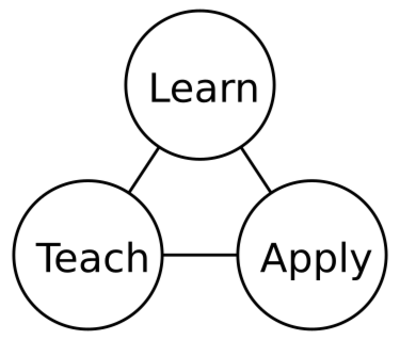

= Ciro Santilli (三西候)
:description: Software engineer. Passion for low-level technologies and educational applications. Opinions are my own.
:docinfo: shared
:idprefix:
:idseparator: -
:sectanchors:
:sectlinks:
:sectnumlevels: 6
:sectnums:
:toc-title:
:toc: macro
:toclevels: 6
:cirosantilli-github: https://github.com/cirosantilli
:cirosantilli-twitter: https://twitter.com/cirosantilli
:cirosantilli-repo-url: https://github.com/cirosantilli/cirosantilli.github.io

{description}

link:{cirosantilli-github}[GitHub] |
link:https://stackoverflow.com/users/895245[Stack Overflow ] |
link:https://www.linkedin.com/in/cirosantilli[LinkedIn] |
link:https://www.youtube.com/channel/UCBrJjpKMpdrkA1VsAiR2wEg[YouTube] |
link:{cirosantilli-twitter}[Twitter] |
link:https://www.zhihu.com/people/cirosantilli/activities[Zhihu 知乎] |
link:https://www.weibo.com/p/1005055601627311[Weibo 微博]

link:me.jpg[image:me.jpg[height=300]] link:logo.png[]

toc::[]

== Getting started with Ciro

=== Quick facts

* Nationalities: Italian and Brazilian
* Grew up in: Brazil
* Relationship status: married
* Chinese name: 三西猴, means "three western monkeys". Phonetic approximation to SANtilli CIRO. Semi-unintentionally reminds Chinese people of https://en.wikipedia.org/wiki/Sun_Wukong[Sun Wukong].
* Laptop: high end ThinkPad
* Distro: latest Ubuntu release
* Vim or Emacs: Vim. But for The Love, will someone please make an open source C++ IDE that actually just works?
* Tabs or spaces: spaces
* Mailing list or Git(Hub|Lab): Git(Hub|Lab), link:https://webapps.stackexchange.com/questions/23197/reply-to-mailman-archived-message/115088#115088[with passion]
* System or unit tests: system
* Default programming languages: Python and C++. https://github.com/cirosantilli/essays/tree/59adcc6dcd0b16430fe97495aa5b98707abc53d8#programming-language-choice[I'll learn Rust and Haskell once I'm rich]
* Favorite musical instruments to listen: https://en.wikipedia.org/wiki/Guqin[Chinese Guqin] and electric Jazz-fusion guitar

=== Contact

To contact me publicly about any general subject that is not covered in a more specif repository, including saying hi or suggestions about this website, create a GitHub issue at: {cirosantilli-repo-url}/issues/new

For comments about China, please first read

* https://github.com/cirosantilli/china-dictatorship#faq
* https://github.com/cirosantilli/china-dictatorship/blob/master/CONTRIBUTING.md

and then create a GitHub issue at: https://github.com/cirosantilli/china-dictatorship/issues/new

If you need private contact, extract my email from on of my GitHub repos or use LinkedIn.

link:https://en.wikipedia.org/wiki/Disqus[Disqus comments] were removed from this website in 2019-05-04, a manual dump is link:/disqus-archive/[available here], removal rationale: <<why-i-removed-disqus-comments-from-the-website-in-2019-05-04>>

=== How to develop this website

This website is powered by link:https://pages.github.com[GitHub Pages].

The source code is located at: {cirosantilli-repo-url}

Build locally, watch for changes and rebuild automatically, and start a local server with:

....
bundle install
./run
....

and then visit the website at:

....
xdg-open http://localhost:8000
....

After making any changes to the README.adoc, simply refresh the page to view the updates.

Source: link:run[]

Source: link:build-adoc[]

Some things in the website need a local sever to be running, notably in older semi-deprecated Jekyll parts, e.g. `index.html` resolution. Run it with:

....
./run
....

Publish changes: TODO

Update the gems with:

....
bundle update
git add Gemfile.lock
git commit -m 'update gems'
....

This website was originally written in Markdown and link:https://github.com/jekyll/jekyll[Jekyll], however those were deprecated in favour of Asciidoctor when I saw the light, rationale shown at: link:/markdown-style-guide#use-asciidoc[]

Jekyll is only used now for backwards compatibility to not break some key content with high PageRank, I might kill it entirely at some point.

GitHub pages is chosen instead of a GitHub README for the following reasons:

* I will want some unsupported extensions, notably mathematics, likely with Katex server side:
** https://github.com/asciidoctor/asciidoctor/pull/3338
** https://stackoverflow.com/questions/11256433/how-to-show-math-equations-in-general-githubs-markdownnot-githubs-blog
** https://g14n.info/2014/09/math-on-github-pages/
** https://stackoverflow.com/questions/11256433/how-to-show-math-equations-in-general-githubs-markdownnot-githubs-blog
** https://www.quora.com/How-can-I-combine-latex-and-markdown-in-GitHub
* when GitHub dies, my website URL still lives and retains the PageRank!

=== License

This website and repository are licensed as: link:https://creativecommons.org/licenses/by-sa/4.0/[CC BY-SA 4.0] unless otherwise noted on a more specific page or header. The license can also be seen at: link:LICENSE[].

== Advanced Ciro usage

=== Accounts

I control the following accounts:

* http://seqanswers.com/forums/member.php?u=90053
* http://answers.gazebosim.org/users/2289/cirosantilli/
* https://4programmers.net/Profile/86786
* https://9gag.com/u/cirosantilli
* https://addons.mozilla.org/en-US/firefox/user/cirosantilli/
* https://androidforums.com/members/ciro-santilli.1918307
* https://ask.libreoffice.org/en/users/2352/cirosantilli/
* https://bbs.archlinux.org/profile.php?id=116270
* https://brilliant.org/profile/ciro-il1uxz/
* link:++https://bugzilla.gnome.org/page.cgi?id=describeuser.html&login=ciro.santilli@gmail.com++[]
* https://cirosantilli.blogspot.com/
* https://cirosantilli.imgur.com
* https://community.arm.com/people/cirosantilli
* https://community.atlassian.com/t5/user/viewprofilepage/user-id/680821
* https://community.plos.org/people/cirosantilli
* https://community.skype.com/t5/user/viewprofilepage/user-id/2646858
* https://community.zimbra.com/members/cirosantilli
* https://del.icio.us/cirosantilli
* https://dev.to/cirosantilli
* https://developer.mbed.org/users/cirosantilli/
* https://devtalk.nvidia.com/member/2118846/
* https://droit-finances.commentcamarche.net/profile/user/cirosantilli
* https://en.wikipedia.org/wiki/User:Ciro.santilli is also mine, but I lost the password
* https://en.wikipedia.org/wiki/User:Cirosantilli2
* https://eternagame.org/web/player/260828/
* https://figshare.com/authors/Ciro_Santilli/656781
* https://forum.osdev.org/memberlist.php?mode=viewprofile&u=16372
* https://forum.videolan.org/memberlist.php?mode=viewprofile&u=173503
* https://forum.xda-developers.com/member.php?u=7116837
* https://forums.androidcentral.com/members/cirosantilli-2734491
* https://framasphere.org/people/78a975c0b6c40133a3032a0000053625 https://framasphere.org/posts/1519871
* https://gitlab.com/u/cirosantilli
* https://hackaday.io/cirosantilli
* https://identity.kde.org/index.php?r=people/view&uid=cirosantilli
* https://jsfiddle.net/user/cirosantilli/
* https://launchpad.net/~cirosantilli
* https://nanohub.org/members/146301/
* https://next-episode.net/user/cirosantilli/
* https://opencollective.com/ciro-santilli
* https://orcid.org/0000-0003-2895-7763
* https://peerj.com/cirosantilli/
* https://profiles.3dgames.com.ar/profiles/1002278
* https://pypi.org/user/cirosantilli/
* https://software.intel.com/en-us/user/1090688
* https://soundcloud.com/cirosantilli
* https://steamcommunity.com/id/cirosantilli/
* https://support.mozilla.org/en-US/user/cirosantilli
* https://tabmixplus.org/forum/memberlist.php?mode=viewprofile&u=59846
* https://talk.commonmark.org/users/cirosantilli
* https://talk.jekyllrb.com/users/cirosantilli
* https://talks.cam.ac.uk/user/show/81142
* https://tatoeba.org/eng/user/profile/cirosantilli
* https://telegram.me/cirosantilli
* https://tuleap.net/users/cirosantilli
* https://tuleap.ring.cx/users/cirosantilli
* https://twittercommunity.com/users/cirosantilli/activity
* https://wiki.qemu.org/User:Cirosantilli
* https://www.airbnb.com/users/show/45794827
* https://www.bibsonomy.org/user/cirosantilli
* https://www.biostars.org/u/50170/
* https://www.bulletphysics.org/Bullet/phpBB3/memberlist.php?mode=viewprofile&u=11704
* https://www.codingame.com/profile/cddd0a711c22d97e8264361f7c8205567563841
* https://www.dailymotion.com/ciro-santilli
* https://www.digitalocean.com/community/users/cirosantilli
* https://www.ebay.com/usr/cirosantilli
* https://www.edaboard.com/member587087.html
* https://www.flickr.com/photos/141515492@N02/
* https://www.freecodecamp.org/fcc8f660b91-167c-4b04-a8da-5d50cdb46def
* https://www.gitbook.com/@cirosantilli
* https://www.hackerrank.com/cirosantilli
* https://www.hackster.io/cirosantilli
* https://www.html5gamedevs.com/profile/30103-cirosantilli/
* https://www.imdb.com/user/ur59802249
* https://www.instagram.com/cirosantilli/
* https://www.kaggle.com/cirosantilli
* https://www.linux.org/members/ciro-santilli.62540/
* https://www.linuxquestions.org/questions/user/cirosantilli-688439/
* https://www.meetup.com/members/252568305/
* https://www.mentebinaria.com.br/profile/1987-ciro-santilli/
* https://www.metacritic.com/user/cirosantilli
* https://www.mudhut.com/user/1995000
* https://www.myopportunity.com/en/profile/ciro-santilli
* https://www.opengl.org/discussion_boards/member.php/40269-cirosantilli
* https://www.patreon.com/cirosantilli
* https://www.plurk.com/cirosantilli
* https://www.quora.com/profile/Ciro-Santilli
* https://www.raspberrypi.org/forums/memberlist.php?mode=viewprofile&u=273389
* https://www.reddit.com/user/cirosantilli/ https://www.reddit.com/r/CirosantilliTest0/comments/5ek3di/i_own_this_website/
* https://www.shadertoy.com/user/cirosantilli
* https://www.tastekid.com/ciro.santilli
* https://www.ted.com/profiles/5822760
* https://www.transifex.com/user/profile/cirosantilli
* https://www.tripadvisor.com/members/cirosantilli

Accounts in Chinese websites. These accounts might be banned or altered or offer other limitations, so I will only communicate briefly through them:

* http://bbs.nibaedu.com/index.php?m=space&uid=70
* http://www.renren.com/338003848/profile
* http://www.tianya.cn/109285544 (can't post, no cell phone)
* https://pincong.rocks/people/cirosantilli
* https://tieba.baidu.com/home/main?id=5cd56369726f73616e74696c6c69c944
* https://v2ex.com/member/cirosantilli
* https://www.zhihu.com/people/cirosantilli. I was https://github.com/cirosantilli/china-dictatorship/tree/746d7e851097bfacfb03149138f0e16c8da9d8db#zhihu-ban[banned in 2018-06-25].

Dead websites:

* http://www.citeulike.org/user/cirosantilli (2019-05)

A younger unrelated Argentinian homonym I've found on Google:

* https://www.facebook.com/profile.php?id=100009065024069
* https://www.youtube.com/channel/UCY44wYp2nEuhMRBU1kHkdCA
* https://twitter.com/cirosantilli7

== Why I removed Disqus comments from the website in 2019-05-04

Commit: https://github.com/cirosantilli/cirosantilli.github.io/commit/794705a201a79b5128934e69df85e3511655c03f

As I started getting a lot of comments on my home page, mostly about China, I decided that Disqus does not scale, and that it would be more productive long term to remove it and point people to GitHub issues instead.

Upsides of removal:

* Disqus discoverability is bad:
** there is no decent way to search existing issues, you have to do JavaScript infinite loading + Ctrl + F. So every reply that I write is a waste of time, as it will never be seen again. 
** comments don't have: decent URLs, titles, metadata like tags or open / close
* Disqus archival is bad: http://web.archive.org/ does not work, and no one knows how to export the issues: https://www.archiveteam.org/index.php?title=Disqus
* before, I had two places where people could comment, Disqus and GitHub issues. Now there is just one.
* Disqus has ads if you ever reach enough traffic, which I'm not willing to have on my website, especially if I don't get paid for them! It also makes page loads slower, although that likely does not matter much.

Downsides:

* people are more likely to comment on Disqus than to create an issue on GitHub, especially because most people use GitHub professionally. But this has the upside that there will be less shitposts as well.
* with Disqus you can see all issues attached to a page automatically, which is nice. But for as long as I'm around, I intend to just solve the issues, cross link between content and issues and tag things appropriately.

My stance towards China hasn't changed, and China comments and corrections about this website are still welcome as always.

Related issue: https://github.com/cirosantilli/cirosantilli.github.io/issues/37

== Video games

The things I like the most about video games as an adult are to watch:

* TAS: https://en.wikipedia.org/wiki/Tool-assisted_speedrun
* speed running evolution videos, which I consider as a probabilistic human achievable TAS

The most beautiful TAS I have ever seen are (highly biased by games I played casually when young):

* Super mario 64
** no-A press 120 stars attempts by shttps://en.wikipedia.org/wiki/Pannenkoek2012
+
2018 video outlining the 18 unique A presses missing for 120-stars at the time: https://www.youtube.com/watch?v=RJaL5QOq590
+
One of the most elaborate explained videos: https://www.youtube.com/watch?v=kpk2tdsPh0A "SM64 - Watch for Rolling Rocks - 0.5x A Presses"
** 1-key any percent run:
*** 2016 emulator run: https://www.youtube.com/watch?v=TkOkJvLKxUY
*** AGDQ 2018 commented TASBOT console verification: https://www.youtube.com/watch?v=xvWOLT9G6tM
*** Why we need one key: https://gaming.stackexchange.com/questions/249969/in-mario-64-speedruns-why-are-the-keys-necessary/351595#351595
* Super Mario World for the SNES abitrary code execution
** https://www.youtube.com/watch?v=OPcV9uIY5i4 with in-game programmed Pong and Snake, 2014
** https://www.youtube.com/watch?v=HxFh1CJOrTU Seth Bling does it manually in about 3 minutes, 2015
*** then he injected a Flappy Bird clone maunally!!! https://www.youtube.com/watch?v=hB6eY73sLV0, 2016
* Zelda ocarina of time wrong warp glitch:
** https://www.youtube.com/watch?v=uCO0jU66g3g 2016 video
** https://www.youtube.com/watch?v=Gso4MuNSuV8 EZScape explains the glitch, 2016

== Physics

=== Particle physics

AKA: standard model.

==== What does it mean that photos are force carriers for electromagnetism?

https://physics.stackexchange.com/questions/61095/photon-as-the-carrier-of-the-electromagnetic-force

==== Why do symmetries such as SU(3)×SU(2)×U(1) matter in particle physics?

TODO.

==== Particle physics applications

* https://www.quora.com/What-if-any-are-the-widespread-applications-of-quantum-field-theory-today
* https://www.quora.com/What-commercial-applications-in-high-energy-particle-physics-and-the-results-coming-out-of-the-LHC-do-we-expect-to-see-in-the-next-5-10-years

==== Quantum Chromodynamics

https://www.youtube.com/watch?v=FoR3hq5b5yE "Quarks, Gluon flux tubes, Strong Nuclear Force, & Quantum Chromodynamics" by "Physics Videos by Eugene Khutoryansky". Some decent visualizations.

==== Particle physics bibliography

Youtube channels:

* PBS Space Time: https://www.youtube.com/channel/UC7_gcs09iThXybpVgjHZ_7g A bit on the superficial side, but OK, 5-10 minute videos.
* Physics Videos by Eugene Khutoryansky https://www.youtube.com/user/EugeneKhutoryansky Some insight, but too slow and not experiments, just "truth".
