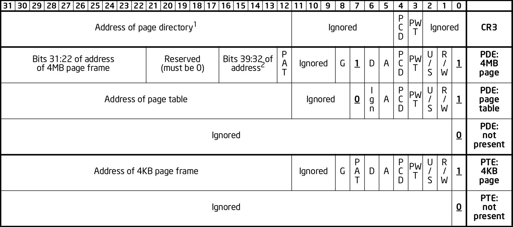

= x86 Paging Tutorial

Extracted and expanded from https://stackoverflow.com/a/18431262/895245[my Stack Overflow answer].

toc::[]

== Sample code

Minimal example: https://github.com/cirosantilli/x86-bare-metal-examples/blob/5c672f73884a487414b3e21bd9e579c67cd77621/paging.S

Like everything else in programming, the only way to really understand this is to play with minimal examples.

What makes this a "hard" subject is that the minimal example is large because you need to make your own small OS.

== Intel manual

Although it is impossible to understand without examples in mind, try to get familiar with the manuals as soon as possible.

Intel describes paging in the https://web.archive.org/web/20151025081259/http://www.intel.com/content/dam/www/public/us/en/documents/manuals/64-ia-32-architectures-software-developer-system-programming-manual-325384.pdf[Intel Manual Volume 3 System Programming Guide - 325384-056US September 2015] Chapter 4 "Paging".

Specially interesting is Figure 4-4 "Formats of CR3 and Paging-Structure Entries with 32-Bit Paging", which gives the key data structures.

== Application

Paging makes it easier to compile and run two programs at the same time on a single computer.

For example, when you compile two programs, the compiler does not know if they are going to be running at the same time or not.

So nothing prevents it from using the same RAM address, say, `0x1234`, to store a global variable.

But if two programs use the same address and run at the same time, this is obviously going to break them!

Paging solves this problem beautifully by adding one degree of indirection:

....
(logical) ------------> (physical)
             paging
....

Where:

* logical addresses are what userland programs see, e.g. the contents of `rsi` in `mov eax, [rsi]`.
+
They are often called "virtual" addresses as well.
* physical addresses can be though of the values that go to physical RAM index wires.
+
But keep in mind that this is not 100% true because of further indirections such as:
** https://en.wikipedia.org/wiki/Memory-mapped_I/O[memory-mapped I/O regions]
** https://en.wikipedia.org/wiki/Multi-channel_memory_architecture[multi channel memory]

Compilers don't need to worry about other programs: they just use simple logical addresses.

As far as programs are concerned, they think they can use any address between 0 and 4GiB (2^32, `FFFFFFFF`) on 32-bit systems.

The OS then sets up paging so that identical logical addresses will go into different physical addresses and not overwrite each other.

This makes it much simpler to compile programs and run them at the same time.

Paging achieves that goal, and in addition:

* the switch between programs is very fast, because it is implemented by hardware
* the memory of both programs can grow and shrink as needed without too much fragmentation
* one program can never access the memory of another program, even if it wanted to.
+
This is good both for security, and to prevent bugs in one program from crashing other programs.

== Hardware implementation

Paging is implemented by the CPU hardware itself.

Paging could be implemented in software, but that would be too slow, because every single RAM memory access uses it!

Operating systems must setup and control paging by communicating to the CPU hardware. This is done mostly via:

* the CR3 register, which tells the CPU where the page table is in RAM memory
* writing the correct paging data structures to the RAM pointed to the CR3 register.
+
Using RAM data structures is a common technique when lots of data must be transmitted to the CPU as it would cost too much to have such a large CPU register.
+
The format of the configuration data structures is fixed _by the hardware_, but it is up to the OS to set up and manage those data structures on RAM correctly, and to tell the hardware where to find them (via `cr3`).
+
Then some heavy caching is done to ensure that the RAM access will be fast, in particular using the TLB.
+
Another notable example of RAM data structure used by the CPU is the https://en.wikipedia.org/wiki/Interrupt_descriptor_table[IDT] which sets up interrupt handlers.

The OS makes it impossible for programs to change the paging setup directly without going through the OS:

* CR3 cannot be modified in ring 3. The OS runs in ring 0. See also:
** https://stackoverflow.com/questions/5957570/what-is-the-difference-between-the-kernel-space-and-the-user-space/44285809#44285809
** https://stackoverflow.com/questions/18717016/what-are-ring-0-and-ring-3-in-os
* the page table structures are made invisible to the process using paging itself!

Processes can however make requests to the OS that cause the page tables to be modified, notably:

* stack size changes
* `brk` and `mmap` calls, see also: https://stackoverflow.com/questions/6988487/what-does-brk-system-call-do/31082353#31082353

The kernel then decides if the request will be granted or not in a controlled manner.

== Segmentation

In x86 systems, there may actually be 2 address translation steps:

* first segmentation
* then paging

As such:

....
(logical) ------------------> (linear) ------------> (physical)
             segmentation                 paging
....

The major difference between paging and segmentation is that:

* paging splits RAM into equal sized chunks called pages
* segmentation splits memory into chunks of arbitrary sizes

This is the main advantage of paging, since equal sized chunks make things more manageable by reducing memory fragmentation problems. See also:

* https://stackoverflow.com/questions/16643180/differences-or-similarities-between-segmented-paging-and-paged-segmentation
* https://softwareengineering.stackexchange.com/questions/100047/why-not-segmentation
* https://www.quora.com/What-is-the-difference-between-paging-and-segment-in-memory-management

Paging came after segmentation historically, and largely replaced it for the implementation of virtual memory in modern OSs.

Paging has become so much more popular that support for segmentation was dropped in x86-64 in 64-bit mode, the main mode of operation for new software, where it only exists in compatibility mode, which emulates IA-32.

== Example: simplified single-level paging scheme

This is an example of how paging operates on a _simplified_ version of a x86 architecture to implement a virtual memory space with a `20 | 12` address split (4 KiB page size).

=== Single level paging scheme visualization

This is how the memory could look like in a single level paging scheme:

....
Links   Data                    Physical address

      +-----------------------+ 2^32 - 1
      |                       |
      .                       .
      |                       |
      +-----------------------+ page0 + 4k
      | data of page 0        |
+---->+-----------------------+ page0
|     |                       |
|     .                       .
|     |                       |
|     +-----------------------+ pageN + 4k
|     | data of page N        |
|  +->+-----------------------+ pageN
|  |  |                       |
|  |  .                       .
|  |  |                       |
|  |  +-----------------------+ CR3 + 2^20 * 4
|  +--| entry[2^20-1] = pageN |
|     +-----------------------+ CR3 + 2^20 - 1 * 4
|     |                       |
|     .    many entires       .
|     |                       |
|     +-----------------------+ CR3 + 2 * 4
|  +--| entry[1] = page1      |
|  |  +-----------------------+ CR3 + 1 * 4
+-----| entry[0] = page0      |
   |  +-----------------------+ <--- CR3
   |  |                       |
   |  .                       .
   |  |                       |
   |  +-----------------------+ page1 + 4k
   |  | data of page 1        |
   +->+-----------------------+ page1
      |                       |
      .                       .
      |                       |
      +-----------------------+  0
....

Notice that:

* the CR3 register points to the first entry of the page table
* the page table is just a large array with 2^20 page table entries
* each entry is 4 bytes big, so the array takes up 4 MiB
* each page table contains the physical address a page
* each page is a 4 KiB aligned 4KiB chunk of memory that user processes may use
* we have 2^20 table entries. Since each page is 4KiB == 2^12, this covers the whole 4GiB (2^32) of 32-bit memory

=== Single level paging scheme numerical translation example

Suppose that the OS has setup the following page tables for process 1:

....
entry index   entry address       page address   present
-----------   ------------------  ------------   -------
0             CR3_1 + 0      * 4  0x00001        1
1             CR3_1 + 1      * 4  0x00000        1
2             CR3_1 + 2      * 4  0x00003        1
3             CR3_1 + 3      * 4                 0
...
2^20-1        CR3_1 + 2^20-1 * 4  0x00005        1
....

And for process 2:

....
entry index   entry address       page address   present
-----------   -----------------   ------------   -------
0             CR3_2 + 0      * 4  0x0000A        1
1             CR3_2 + 1      * 4  0x12345        1
2             CR3_2 + 2      * 4                 0
3             CR3_2 + 3      * 4  0x00003        1
...
2^20-1        CR3_2 + 2^20-1 * 4  0xFFFFF        1
....

Before process 1 starts running, the OS sets its `cr3` to point to the page table 1 at `CR3_1`.

When process 1 tries to access a linear address, this is the physical addresses that will be actually accessed:

....
linear     physical
---------  ---------
00000 001  00001 001
00000 002  00001 002
00000 003  00001 003
00000 FFF  00001 FFF
00001 000  00000 000
00001 001  00000 001
00001 FFF  00000 FFF
00002 000  00003 000
FFFFF 000  00005 000
....

To switch to process 2, the OS simply sets `cr3` to `CR3_2`, and now the following translations would happen:

....
linear     physical
---------  ---------
00000 002  0000A 002
00000 003  0000A 003
00000 FFF  0000A FFF
00001 000  12345 000
00001 001  12345 001
00001 FFF  12345 FFF
00004 000  00003 000
FFFFF 000  FFFFF 000
....

Step-by-step translation for process 1 of logical address `0x00000001` to physical address `0x00001001`:

* split the linear address into two parts:
+
....
| page (20 bits) | offset (12 bits) |
....
+
So in this case we would have:
** page = 0x00000. This part must be translated to a physical location.
** offset = 0x001. This part is added directly to the page address, and is not translated: it contains the position _within_ the page.
* look into Page table 1 because `cr3` points to it.
* The hardware knows that this entry is located at RAM address `CR3 + 0x00000 * 4 = CR3`:
** `0x00000` because the page part of the logical address is `0x00000`
** `4` because that is the fixed size in bytes of every page table entry
* since it is present, the access is valid
* by the page table, the location of page number `0x00000` is at `0x00001 * 4K = 0x00001000`.
* to find the final physical address we just need to add the offset:
+
....
  00001 000
+ 00000 001
  ---------
  00001 001
....
+
because `00001` is the physical address of the page looked up on the table and `001` is the offset.
+
We shift `00001` by 12 bits because the pages are always aligned to 4KiB.
+
The offset is always simply added the physical address of the page.
* the hardware then gets the memory at that physical location and puts it in a register.

Another example: for logical address `0x00001001`:

* the page part is `00001`, and the offset part is `001`
* the hardware knows that its page table entry is located at RAM address: `CR3 + 1 * 4` (`1` because of the page part), and that is where it will look for it
* it finds the page address `0x00000` there
* so the final address is `0x00000 * 4k + 0x001 = 0x00000001`

=== Multiple addresses translate to a single physical address

The same linear address can translate to different physical addresses for different processes, depending only on the value inside `cr3`.

Both linear addresses `00002 000` from process 1 and `00004 000` from process 2 point to the same physical address `00003 000`. This is completely allowed by the hardware, and it is up to the operating system to handle such cases.

This often in normal operation because of Copy-on-write (COW), which be explained elsewhere.

Such mappings are sometime called "aliases".

=== Identity mapping

`FFFFF 000` points to its own physical address `FFFFF 000`. This kind of translation is called an "identity mapping", and can be very convenient for OS-level debugging.

=== Page faults

What if Process 1 tries to access `0x00003000`, which is not present?

The hardware notifies the software via a Page Fault Exception.

When an exception happens, the CPU jumps to an address that the OS had previously registered as the fault handler. This is usually done at boot time by the OS.

This could happen for example due to a programming error:

....
int *is = malloc(1);
is[2] = 1;
....

but there are cases where it is not a bug, for example in Linux when:

* the program wants to increase its stack.
+
It just tries to accesses a certain byte in a given possible range, and if the OS is happy it adds that page to the process address space, otherwise, it sends a signal to the process.
* the page was swapped to disk.
+
The OS will need to do some work behind the processes back to get the page back into RAM.
+
The OS can discover that this is the case based on the contents of the rest of the page table entry, since if the present flag is clear, the other entries of the page table entry are completely left for the OS to to what it wants.
+
On Linux for example, when present = 0:
** if all the fields of the page table entry are 0, invalid address.
** else, the page has been swapped to disk, and the actual values of those fields encode the position of the page on the disk.

In any case, the OS needs to know which address generated the Page Fault to be able to deal with the problem. This is why the nice IA32 developers set the value of `cr2` to that address whenever a Page Fault occurs. The exception handler can then just look into `cr2` to get the address.

=== Page table entries

The exact format of table entries is fixed _by the hardware_.

Each page entry can be seen as a `struct` with many fields.

The page table is then an array of `struct`.

On this simplified example, the page table entries contain only two fields:

....
bits   function
-----  -----------------------------------------
20     physical address of the start of the page
1      present flag
....

so in this example the hardware designers could have chosen the size of the page table to b `21` instead of `32` as we've used so far.

All real page table entries have other fields, notably fields to set pages to read-only for Copy-on-write. This will be explained elsewhere.

It would be impractical to align things at 21 bytes since memory is addressable by bytes and not bits. Therefore, even in only 21 bits are needed in this case, hardware designers would probably choose 32 to make access faster, and just reserve bits the remaining bits for later usage. The actual value on x86 is 32 bits.

Here is a screenshot from the Intel manual image "Formats of CR3 and Paging-Structure Entries with 32-Bit Paging" showing the structure of a page table in all its glory: <<image-x86-page-entry>>.

[[image-x86-page-entry]]
[link=#image-x86-page-entry]
.x86 Page Entry format

The fields are explained in the manual just after.

=== Page size choice

Why are pages 4KiB anyways?

There is a trade-off between memory wasted in:

* page tables
* extra padding memory within pages

This can be seen with the extreme cases:

* if the page size were 1 byte:
** granularity would be great, and the OS would never have to allocate unneeded padding memory
** but the page table would have 2^32 entries, and take up the entire memory!
* if the page size were 4GiB:
** we would need to swap 4GiB to disk every time a new process becomes active
** the page size would be a single entry, so it would take almost no memory at all

x86 designers have found that 4KiB pages are a good middle ground.

== Example: multi-level paging scheme

=== The problem with single-level paging

The problem with a single-level paging scheme is that it would take up too much RAM: 4G / 4K = 1M entries _per_ process.

If each entry is 4 bytes long, that would make 4M _per process_, which is too much even for a desktop computer: `ps -A | wc -l` says that I am running 244 processes right now, so that would take around 1GB of my RAM!

For this reason, x86 developers decided to use a multi-level scheme that reduces RAM usage.

The downside of this system is that is has a slightly higher access time, as we need to access RAM more times for each translation.

=== K-ary trees to the rescue

The algorithmically minded will have noticed that paging requires https://en.wikipedia.org/wiki/Associative_array[associative array] (like Java `Map` of Python `dict()`) abstract data structure where:

* the keys are linear pages addresses, thus of integer type
* the values are physical page addresses, also of integer type

The single level paging scheme uses a simple array implementation of the associative array:

* the keys are the array index
* this implementation is very fast in time
* but it is too inefficient in memory

and in C pseudo-code it looks like this:

....
linear_address[0]      = physical_address_0
linear_address[1]      = physical_address_1
linear_address[2]      = physical_address_2
...
linear_address[2^20-1] = physical_address_N
....

But there another simple associative array implementation that overcomes the memory problem: an (unbalanced) https://en.wikipedia.org/wiki/K-ary_tree[K-ary tree].

A K-ary tree, is just like a https://en.wikipedia.org/wiki/Binary_tree[binary tree], but with K children instead of 2.

Using a K-ary tree instead of an array implementation has the following trade-offs:

* it uses way less memory
* it is slower since we have to de-reference extra pointers

In C-pseudo code, a 2-level K-ary tree with `K = 2^10` looks like this:

....
level0[0] = &level1_0[0]
    level1_0[0]      = physical_address_0_0
    level1_0[1]      = physical_address_0_1
    ...
    level1_0[2^10-1] = physical_address_0_N
level0[1] = &level1_1[0]
    level1_1[0]      = physical_address_1_0
    level1_1[1]      = physical_address_1_1
    ...
    level1_1[2^10-1] = physical_address_1_N
...
level0[N] = &level1_N[0]
    level1_N[0]      = physical_address_N_0
    level1_N[1]      = physical_address_N_1
    ...
    level1_N[2^10-1] = physical_address_N_N
....

and we have the following arrays:

* one `directory`, which has `2^10` elements. Each element contains a pointer to a page table array.
* up to 2^10 `pagetable` arrays. Each one has `2^10` 4 byte page entries.

and it still contains `2^10 * 2^10 = 2^20` possible keys.

K-ary trees can save up a lot of space, because if we only have one key, then we only need the following arrays:

* one `directory` with 2^10 entries
* one `pagetable` at `directory[0]` with 2^10 entries
* all other `directory[i]` are marked as invalid, don't point to anything, and we don't allocate `pagetable` for them at all

=== Why not a balanced tree

Learned readers will ask themselves: so why use an unbalanced tree instead of balanced one, which offers better asymptotic times https://en.wikipedia.org/wiki/Self-balancing_binary_search_tree?

Likely:

* the maximum number of entries is small enough due to memory size limitations, that we won't waste too much memory with the root directory entry
* different entries would have different levels, and thus different access times
* tree rotations would likely make caching more complicated

=== How the K-ary tree is used in x86

x86's multi-level paging scheme uses a 2 level K-ary tree with 2^10 bits on each level.

Addresses are now split as:

....
| directory (10 bits) | table (10 bits) | offset (12 bits) |
....

Then:

* the top 10 bits are used to walk the top level of the K-ary tree (`level0`)
+
The top table is called a "directory of page tables".
+
`cr3` now points to the location on RAM of the page directory of the current process instead of page tables.
+
Page directory entries are very similar to page table entries except that they point to the physical addresses of page tables instead of physical addresses of pages.
+
Each directory entry also takes up 4 bytes, just like page entries, so that makes 4 KiB per process minimum.
+
Page directory entries also contain a valid flag: if invalid, the OS does not allocate a page table for that entry, and saves memory.
+
Each process has one and only one page directory associated to it (and pointed to by `cr3`), so it will contain at least `2^10 = 1K` page directory entries, much better than the minimum 1M entries required on a single-level scheme.
* the next 10 bits are used to walk the second level of the K-ary tree (`level1`)
+
Second level entries are also called page tables like the single level scheme.
+
Page tables are only allocated only as needed by the OS.
+
Each page table has only `2^10 = 1K` page table entries instead of `2^20` for the single paging scheme.
+
Each process can now have up to `2^10` page tables instead of `2^20` for the single paging scheme.
* the offset is again not used for translation, it only gives the offset within a page

One reason for using 10 bits on the first two levels (and not, say, `12 | 8 | 12` ) is that each Page Table entry is 4 bytes long. Then the 2^10 entries of Page directories and Page Tables will fit nicely into 4Kb pages. This means that it faster and simpler to allocate and deallocate pages for that purpose.

=== Multi-level paging scheme numerical translation example

Page directory given to process by the OS:

....
entry index   entry address      page table address  present
-----------   ----------------   ------------------  --------
0             CR3 + 0      * 4   0x10000             1
1             CR3 + 1      * 4                       0
2             CR3 + 2      * 4   0x80000             1
3             CR3 + 3      * 4                       0
...
2^10-1        CR3 + 2^10-1 * 4                       0
....

Page tables given to process by the OS at `PT1 = 0x10000000` (`0x10000` * 4K):

....
entry index   entry address      page address  present
-----------   ----------------   ------------  -------
0             PT1 + 0      * 4   0x00001       1
1             PT1 + 1      * 4                 0
2             PT1 + 2      * 4   0x0000D       1
...                                  ...
2^10-1        PT1 + 2^10-1 * 4   0x00005       1
....

Page tables given to process by the OS at `PT2  = 0x80000000` (`0x80000` * 4K):

....
entry index   entry address     page address  present
-----------   ---------------   ------------  ------------
0             PT2 + 0     * 4   0x0000A       1
1             PT2 + 1     * 4   0x0000C       1
2             PT2 + 2     * 4                 0
...
2^10-1        PT2 + 0x3FF * 4   0x00003       1
....

where `PT1` and `PT2`: initial position of page table 1 and page table 2 for process 1 on RAM.

With that setup, the following translations would happen:

....
linear    10 10 12 split  physical
--------  --------------  ----------
00000001  000 000 001     00001001
00001001  000 001 001     page fault
003FF001  000 3FF 001     00005001
00400000  001 000 000     page fault
00800001  002 000 001     0000A001
00801004  002 001 004     0000C004
00802004  002 002 004     page fault
00B00001  003 000 000     page fault
....

Let's translate the linear address `0x00801004` step by step:

* In binary the linear address is:
+
....
0    0    8    0    1    0    0    4
0000 0000 1000 0000 0001 0000 0000 0100
....
* Grouping as `10 | 10 | 12` gives:
+
....
0000000010 0000000001 000000000100
0x2        0x1        0x4
....
+
which gives:
+
....
page directory entry = 0x2
page table     entry = 0x1
offset               = 0x4
....
+
So the hardware looks for entry 2 of the page directory.
* The page directory table says that the page table is located at `0x80000 * 4K = 0x80000000`. This is the first RAM access of the process.
+
Since the page table entry is `0x1`, the hardware looks at entry 1 of the page table at `0x80000000`, which tells it that the physical page is located at address `0x0000C * 4K = 0x0000C000`. This is the second RAM access of the process.
* Finally, the paging hardware adds the offset, and the final address is `0x0000C004`.

Page faults occur if either a page directory entry or a page table entry is not present.

The Intel manual gives a picture of this translation process in the image "Linear-Address Translation to a 4-KByte Page using 32-Bit Paging": <<image-x86-page-translation>>:

[[image-x86-page-translation]]
[link=#image-x86-page-translation]
.x86 Page Translation
image::x86-page-translation.png[height=300]

== 64-bit architectures

64 bits is still too much address for current RAM sizes, so most architectures will use less bits.

x86_64 uses 48 bits (256 TiB), and legacy mode's PAE already allows 52-bit addresses (4 PiB). 56-bits is a likely future candidate.

12 of those 48 bits are already reserved for the offset, which leaves 36 bits.

If a 2 level approach is taken, the best split would be two 18 bit levels.

But that would mean that the page directory would have `2^18 = 256K` entries, which would take too much RAM: close to a single-level paging for 32 bit architectures!

Therefore, 64 bit architectures create even further page levels, commonly 3 or 4.

x86_64 uses 4 levels in a `9 | 9 | 9 | 9` scheme, so that the upper level only takes up only `2^9` higher level entries.

The 48 bits are split equally into two disjoint parts:

....
----------------- FFFFFFFF FFFFFFFF
Top half
----------------- FFFF8000 00000000

Not addressable

----------------- 00007FFF FFFFFFFF
Bottom half
----------------- 00000000 00000000
....

A 5-level scheme is emerging in 2016: https://software.intel.com/sites/default/files/managed/2b/80/5-level_paging_white_paper.pdf which allows 52-bit addresses with 4k pagetables.

== PAE

Physical address extension.

With 32 bits, only 4GB RAM can be addressed.

This started becoming a limitation for large servers, so Intel introduced the PAE mechanism to Pentium Pro.

To relieve the problem, Intel added 4 new address lines, so that 64GB could be addressed.

Page table structure is also altered if PAE is on. The exact way in which it is altered depends on weather PSE is on or off.

PAE is turned on and off via the `PAE` bit of `cr4`.

Even if the total addressable memory is 64GB, individual process are still only able to use up to 4GB. The OS can however put different processes on different 4GB chunks.

== PSE

Page size extension.

Allows for pages to be 4M ( or 2M if PAE is on ) in length instead of 4K.

PSE is turned on and off via the `PAE` bit of `cr4`.

== PAE and PSE page table schemes

If either PAE and PSE are active, different paging level schemes are used:

* no PAE and no PSE: `10 | 10 | 12`
* no PAE and PSE: `10 | 22`.
+
22 is the offset within the 4Mb page, since 22 bits address 4Mb.
* PAE and no PSE: `2 | 9 | 9 | 12`
+
The design reason why 9 is used twice instead of 10 is that now entries cannot fit anymore into 32 bits, which were all filled up by 20 address bits and 12 meaningful or reserved flag bits.
+
The reason is that 20 bits are not enough anymore to represent the address of page tables: 24 bits are now needed because of the 4 extra wires added to the processor.
+
Therefore, the designers decided to increase entry size to 64 bits, and to make them fit into a single page table it is necessary reduce the number of entries to 2^9 instead of 2^10.
+
The starting 2 is a new Page level called Page Directory Pointer Table (PDPT), since it _points_ to page directories and fill in the 32 bit linear address. PDPTs are also 64 bits wide.
+
`cr3` now points to PDPTs which must be on the fist four 4GB of memory and aligned on 32 bit multiples for addressing efficiency. This means that now `cr3` has 27 significative bits instead of 20: 2^5 for the 32 multiples * 2^27 to complete the 2^32 of the first 4GB.
* PAE and PSE: `2 | 9 | 21`
+
Designers decided to keep a 9 bit wide field to make it fit into a single page.
+
This leaves 23 bits. Leaving 2 for the PDPT to keep things uniform with the PAE case without PSE leaves 21 for offset, meaning that pages are 2M wide instead of 4M.

== TLB

The Translation Lookahead Buffer (TLB) is a cache for paging addresses.

Since it is a cache, it shares many of the design issues of the CPU cache, such as associativity level.

This section shall describe a simplified fully associative TLB with 4 single address entries. Note that like other caches, real TLBs are not usually fully associative.

=== Basic operation

After a translation between linear and physical address happens, it is stored on the TLB. For example, a 4 entry TLB starts in the following state:

....
  valid  linear  physical
  -----  ------  --------
> 0      00000   00000
  0      00000   00000
  0      00000   00000
  0      00000   00000
....

The `>` indicates the current entry to be replaced.

and after a page linear address `00003` is translated to a physical address `00005`, the TLB becomes:

....
  valid  linear  physical
  -----  ------  --------
  1      00003   00005
> 0      00000   00000
  0      00000   00000
  0      00000   00000
....

and after a second translation of `00007` to `00009` it becomes:

....
  valid  linear  physical
  -----  ------  --------
  1      00003   00005
  1      00007   00009
> 0      00000   00000
  0      00000   00000
....

Now if `00003` needs to be translated again, hardware first looks up the TLB and finds out its address with a single RAM access `00003 --> 00005`.

Of course, `00000` is not on the TLB since no valid entry contains `00000` as a key.

=== Replacement policy

When TLB is filled up, older addresses are overwritten. Just like CPU cache, the replacement policy is a potentially complex operation, but a simple and reasonable heuristic is to remove the least recently used entry (LRU).

With LRU, starting from state:

....
  valid  linear  physical
  -----  ------  --------
> 1      00003   00005
  1      00007   00009
  1      00009   00001
  1      0000B   00003
....

adding `0000D -> 0000A` would give:

....
  valid  linear  physical
  -----  ------  --------
  1      0000D   0000A
> 1      00007   00009
  1      00009   00001
  1      0000B   00003
....

=== CAM

Using the TLB makes translation faster, because the initial translation takes one access _per TLB level_, which means 2 on a simple 32 bit scheme, but 3 or 4 on 64 bit architectures.

The TLB is usually implemented as an expensive type of RAM called content-addressable memory (CAM). CAM implements an associative map on hardware, that is, a structure that given a key (linear address), retrieves a value.

Mappings could also be implemented on RAM addresses, but CAM mappings may required much less entries than a RAM mapping.

For example, a map in which:

* both keys and values have 20 bits (the case of a simple paging schemes)
* at most 4 values need to be stored at each time

could be stored in a TLB with 4 entries:

....
linear  physical
------  --------
00000   00001
00001   00010
00010   00011
FFFFF   00000
....

However, to implement this with RAM, _it would be necessary to have 2^20 addresses_:

....
linear  physical
------  --------
00000   00001
00001   00010
00010   00011
... (from 00011 to FFFFE)
FFFFF   00000
....

which would be even more expensive than using a TLB.

=== Invalidating entries

When `cr3` changes, all TLB entries are invalidated, because a new page table for a new process is going to be used, so it is unlikely that any of the old entries have any meaning.

The x86 also offers the `invlpg` instruction which explicitly invalidates a single TLB entry. Other architectures offer even more instructions to invalidated TLB entries, such as invalidating all entries on a given range.

== Linux kernel usage

The Linux kernel makes extensive usage of the paging features of x86 to allow fast process switches with small data fragmentation.

=== Play with physical addresses in Linux

Convert virtual addresses to physical from user space with `/proc/<pid>/pagemap` and from kernel space with `virt_to_phys`:

* https://stackoverflow.com/questions/5748492/is-there-any-api-for-determining-the-physical-address-from-virtual-address-in-li/45128487#45128487
* https://github.com/cirosantilli/linux-kernel-module-cheat/blob/1f4f7faebacca75267cc1d63bfeffc30080d017d/kernel_module/user/virt_to_phys_user.c
* `virt_to_phys`:
** https://github.com/cirosantilli/linux-kernel-module-cheat/blob/0677dbd4b582d1a913462d75caad0abf21e87f32/kernel_module/virt_to_phys.c
** https://github.com/cirosantilli/linux-kernel-module-cheat/blob/1f4f7faebacca75267cc1d63bfeffc30080d017d/kernel_module/user/virt_to_phys_user.c

Dump all page tables from userspace with `/proc/<pid>/maps` and `/proc/<pid>/pagemap`:

* https://github.com/cirosantilli/linux-kernel-module-cheat/blob/1f4f7faebacca75267cc1d63bfeffc30080d017d/kernel_module/user/virt_to_phys_user.c
* https://stackoverflow.com/questions/6284810/proc-pid-pagemaps-and-proc-pid-maps-linux/45500208#45500208

Read and write physical addresses from userspace with `/dev/mem`:

* https://stackoverflow.com/questions/12040303/accessing-physical-address-from-user-space/45127890#45127890
* https://free-electrons.com/pub/mirror/devmem2.c

=== Kernel vs process memory layout

The Linux Kernel reserves two zones of virtual memory:

* one for kernel memory
* one for programs

The exact split is configured by `CONFIG_VMSPLIT_...`. By default:

* on 32-bit:
** the bottom 3/4 is program space: `00000000` to `BFFFFFFF`
** the top 1/4 is kernel memory: `C0000000` to `FFFFFFFF`
+
Like this:
+
....
------------------ FFFFFFFF
Kernel
------------------ C0000000
------------------ BFFFFFFF

Process

------------------ 00000000
....
* on 64-bit: currently only 48-bits are actually used, split into two equally sized disjoint spaces. The Linux kernel just assigns:
** the bottom part to processes `00000000 00000000` to `008FFFFF FFFFFFFF`
** the top part to the kernel: `FFFF8000 00000000` to `FFFFFFFF FFFFFFFF`
+
Like this:
+
....
------------------ FFFFFFFF
Kernel
------------------ C0000000

(not addressable)

------------------ BFFFFFFF
Process
------------------ 00000000
....

Kernel memory https://stackoverflow.com/questions/18953598/is-it-true-that-whole-system-space-address-space-in-linux-does-not-use-demand-pa[is also paged].

In previous versions, https://stackoverflow.com/questions/1658757/linux-3-1-virtual-address-split[the paging was continuous, but with HIGHMEM this changed].

There is no clear physical memory split: https://stackoverflow.com/questions/30471742/physical-memory-userspace-kernel-split-on-linux-x86-64

=== Process memory layout

For each process, the virtual address space looks like this:

....
------------------ 2^32 - 1
Stack (grows down)
v v v v v v v v v
------------------

(unmapped)

------------------ Maximum stack size.

(unmapped)

-------------------
mmap
-------------------

(unmapped)

-------------------
^^^^^^^^^^^^^^^^^^^
brk (grows up)
-------------------
BSS
-------------------
Data
-------------------
Text
-------------------

------------------- 0
....

The kernel maintains a list of pages that belong to each process, and synchronizes that with the paging.

If the program accesses memory that does not belong to it, the kernel handles a page-fault, and decides what to do:

* if it is above the maximum stack size, allocate those pages to the process
* otherwise, send a SIGSEGV to the process, which usually kills it

When an ELF file is loaded by the kernel to start a program with the `exec` system call, the kernel automatically registers text, data, BSS and stack for the program.

The `brk` and `mmap` areas can be modified by request of the program through the https://stackoverflow.com/questions/6988487/what-does-brk-system-call-do/31082353#31082353[`brk`] and `mmap` system calls. But the kernel can also deny the program those areas if there is not enough memory.

`brk` and `mmap` can be used to implement `malloc`, or the so called "heap".

`mmap` is also used to load dynamically loaded libraries into the program's memory so that it can access and run it.

Stack allocation: https://stackoverflow.com/questions/17671423/stack-allocation-for-process

Calculating exact addresses Things are complicated by:

* https://en.wikipedia.org/wiki/Address_space_layout_randomization[Address Space Layout Randomization].
* the fact that environment variables, CLI arguments, and some ELF header data take up initial stack space: https://unix.stackexchange.com/questions/145557/how-does-stack-allocation-work-in-linux/239323#239323

Why the text does not start at 0: https://stackoverflow.com/questions/14795164/why-do-linux-program-text-sections-start-at-0x0804800-and-stack-tops-start-at-0

=== Copy-on-write

https://en.wikipedia.org/wiki/Copy-on-write

Besides a missing page, a very common source of page faults is copy-on-write (COW).

Page tables have extra flags that allow the OS to mark a page a read-only.

Those page faults only happen when a process tries to write to the page, and not read from it.

When Linux forks a process:

* instead of copying all the pages, which is unnecessarily costly, it makes the page tables of the two process point to the same physical address.
* it marks those linear addresses as read-only
* whenever one of the processes tries to write to a page, the makes a copy of the physical memory, and updates the pages of the two process to point to the two different physical addresses

=== Linux source tree

In `v4.2`, look under `arch/x86/`:

* `include/asm/pgtable*`
* `include/asm/page*`
* `mm/pgtable*`
* `mm/page*`

There seems to be no structs defined to represent the pages, only macros: `include/asm/page_types.h` is specially interesting. Excerpt:

....
#define _PAGE_BIT_PRESENT   0   /* is present */
#define _PAGE_BIT_RW        1   /* writeable */
#define _PAGE_BIT_USER      2   /* userspace addressable */
#define _PAGE_BIT_PWT       3   /* page write through */
....

`arch/x86/include/uapi/asm/processor-flags.h` defines `CR0`, and in particular the `PG` bit position:

....
#define X86_CR0_PG_BIT      31 /* Paging */
....

== Memory management unit

Paging is done by the https://en.wikipedia.org/wiki/Memory_management_unit[Memory Management Unit] (MMU) part of the CPU.

Like many others (e.g. https://en.wikipedia.org/wiki/X87[x87 co-processor], https://en.wikipedia.org/wiki/Advanced_Programmable_Interrupt_Controller[APIC]), this used to be by separate chip on early days.

It was later integrated into the CPU, but the term MMU still used.

== Second Level Address Translation

https://en.wikipedia.org/wiki/Second_Level_Address_Translation

Two level address translation to make OS emulation more efficient.

== Other architectures

https://stackoverflow.com/a/32258855/895245[Peter Cordes mentions] that some architectures like MIPS leave paging almost completely in the hands of software: a TLB miss runs an OS-supplied function to walk the page tables, and insert the new mapping into the TLB. In such architectures, the OS can use whatever data structure it wants.

=== ARM

Information about ARM paging can be found at: https://github.com/cirosantilli/linux-kernel-module-cheat#arm-paging

== Bibliography

Free:

* https://www.cs.rutgers.edu/~pxk/416/notes/[rutgers-pxk-416] chapter "Memory management: lecture notes"
+
Good historical review of memory organization techniques used by older OS.

Non-free:

* https://www.amazon.com/books/dp/0596005652[bovet05] chapter "Memory addressing"
+
Reasonable intro to x86 memory addressing. Missing some good and simple examples.
